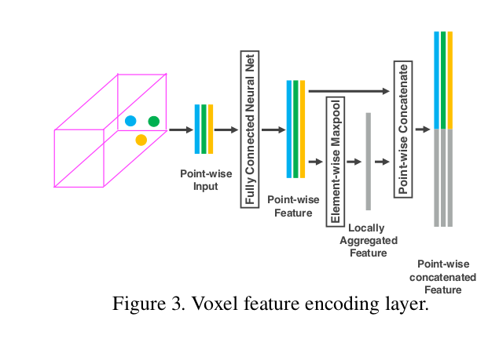

# Dataset

## [SUN3D](http://vision.princeton.edu/projects/2013/SUN3D/paper.pdf)

### Introduction

incorporate 3D reconstruction with 3D labeling, since you just need to label a single object, and after reconstructio, you can get all the labels in all the frames.  

Some resources:

1. RGB-D camera to prodeuce 3D models of spaces [10, 4, 15]  
2. Neuro Science [17] study finds that PPA(represent scenes and spatial layouts, has a view-specific representation ) and RSC (for navigation, route learning , has a place-centric representation ) are complementary.
3. Other 3D dataset : NYU Depth Dataset \ SUN[24]

### Capturing Process

this dataset can be viewed as **Point Cloud** , **3D object model**, **viewpoints of objects**, **bird's-eye view of room**.

Setup: sensor: ASUS Xtion PRO LIVE

Register Methods: We begin by matching key-points using SIFT and remove poor matches using the ratio test. With SIFT results,  we choose the **ones with valid depth values** , and use a 3-point-algorithm inside a RANSAC loop to find relative transformation. As for fillng te holes in depthm map, one approach is to use cross-bilateral [20] , OR TSDF(voxelize the space) [15].
  
Loop closure: Bag of Words ; Joint 2D , 3D bundle adjustment :
$$ min \sum_{c}\sum_{c \in V(c)}(||\tilde{x_{p}^{c}}-K[R_{c}|t_{c}]X_{p}||^{2} + \lambda ||\tilde{X_{p}^{c}} - [R_{c}|t_{c}X_{p}||^{2}) $$
$\tilde{X_{p}^{c}}$ and $\tilde{x_{p}^{c}}$ is the observed 3D(RGB-D), 2D point and $X_{p}$ is the ground truth 3D point. (bundle adjustment to minimize the error)

## Jacquard: A Large Scale Dataset for robotic Grasp Detection

### Introduction

SOTA methods include predicting the manually labeled grasp or evaluating the previuosly generated candidates and select the best one.

# 3D Vision

## VoxelNet: End-to-End Learning for Point Cloud Based 3D Object Dectection

### Intro

Hand-crafted features are [39,7,8,19,40,33,6,25,1,34,2]; directly predict the 3D bounding box from 2D images [4,3,42,43,44,36]; d

related works are PointNet[29 ] and its improved version[30 ]

Summarize as below:

1. a novel end-to-end deep architecture --> VoxelNet, directly operates on sparse 3D points.
2. propose parallel processing methods

### Architecture

Three Functional blocks: 1) Feature Learning Network; 2) Convolutional Middle Layer; 3) RPN

FLN(feature learning network): **Grouping** : group the points according to the voxel they reside in. Due to the disparity of point cloud in the space, a voxel will contain a variable number of points. **Random Sampling** : sample T points from voxels containing more that T points. This is due to the highly variable density throughout the space. **Feature Encoding**: Denote $V = \{ p_{i} = [x_{i}, y_{i}, z_{i}, r_{i}]^{T} \in R^{4} \}_{i=1,...,T}$ (maybe we can substitute r --> r,g,b). First the centroid is computed as ($v_{x}$,$v_{y}$, $v_{z}$). $V_{in} = \{ \hat{p_{i}} = [x_{i}, y_{i},z_{i}, r_{i}, x_{i} - v_{x}, y_{i} - v_{y}, z_{i} - v_{z} ]^{T} \in R^{7}  \}_{t=1,...,T}$, and each $\hat{p_{i}}$ is fed into a VEF Module.

VEF Module ( Linear Layer, Batch Norm, RELU, Maxpool ) to have point-wise information. Use element-wise maxpool across all $f_{i} \in V$ --> $\tilde{f} \in R^{m}$ *m is the feature channel* (perform on each channel) and aggregate the information: $f_{i}^{out} = [f_{i}^{T}, \tilde{f}^{T}]^{T} \in R^{2m}$. A VEF($c_{in}$, $c_{out}$) learn parameters $c_{in} * (c_{out} / 2)$.

After VEF, each voxel has a representing feature vector $f^{out} \in R^{c}$. Thus form a 4D tensor C * D * H * W. H, D, W is the voxel number along each dimension.

RPN network, as shown in the figure. Notice: After the middle convolution ($C*D*W*H$), reshape it to ($(C*D)*W*H$) and send to RPN.

Loss Function: 

### Arguments

Random Sampling from voxels

## Contrast Prior and Fluid Pyramid Integration for RGBD Salient Object Detection

### Intro

Salient object detection : distinguish the most distinctive obeject in the scene. Works to utilize the depth image in DNN [4]. In image segmentation [17, 40] ; object recognition [46 ]; visual tracking [3]

methods to use depth information: concatenate depth feature map with RGB feature map at early/middle/late stage.  This fails due to :

1. Shortage of high quality map : depth maps are much noiser and textureless than RGB
2. depth and RGB have very different properties. (color in each image has differnet "meaning") Simple fusion like linear combination and concatenation fails. 

instances of these methods are [4, 18, 20, 49, 27, 28, 55]. **The author proposes to use the contrast prior to enhance the depth map. Then the depth map is used as an attention map.**
>contrast proir is proposed in [4, 18, 20, 49]; Notice , [2] is the benchmark of salient object detection; [11,50] are neural evidence for the contrast prior.

Summary as below:

1. a contrast loss is designed to utiliza the contrast prior, for depth map enhancement.
2. fluid pyramid integration is proposed to make use of multi-scale cross-modal features.

### Architeture

the whole net is shown as below:

the skeleton is VGG-16 (its first 5 blocks), and embed a FEM at the end of each block. The FEM ( Feature-enhanced Module ) : CEN & Cross-Modal fusion. The architecture of the CEN is repeats of the blocks --> conv(4,32,2) + conv(3,32,1) + RELU. *conv(kernel_size, number_of_channels, stride)* The block is repeated untill the feature map holds the same size with the RGB feature map counterpart. Then, two more convolutional layers are followed. (conv(3,32,1) + conv(3,1,1) + sigmoid) *then output looks like a prediction(pixel-wise)*

CEN (Contrast-enhanced Net) [inspired by 14],  utilize the contrast between foreground and background as well as uniform distribution in the foreground. Contrast loss is composed of foreground object distribution loss $l_{f}$ , background distribution loss $l_{b}$, whole depth image distribution loss $l_{w}$.
$$ l_{f} = -log(1-4*\sum_{(i,j) \in F} \frac{(p_{i,j}-\hat{p_{f}})^{2}}{N_{F}} )$$
$$ l_{b} = -log(1-4*\sum_{(i,j)\in B} \frac{(p_{i,j}-\hat{p_{f}})^{2}}{N_{B}} )$$
$l_{f}$ and $l_{b}$ **are to make the enhanced map coherent with the original depth map for both foreground and background objects**. F and B are foreground and background region in the image. $\hat{p_{f}}$ and $\hat{p_{b}}$ are the mean value in foreground and background respectively.$l_{w}$**is designed to enhance the difference of foreground and background**
$$l_{w} = -log(\hat{p_{f}} - \hat{p_{b}})^{2}$$
And the **Contrast Loss** is :
$$ l_{c} = \alpha_{1} l_{f} + \alpha_{2} l_{b} + \alpha_{3} l_{w}$$

Cross-modal fusion: the enhanced map is one-channel, similar to an attention map[21, 25]. The RGB feature map is enhanced according to this enhanced map through multiplication, and then adds to the original map.

FPI(Fluid Pyramid Integration): take the output from each FEM, upsample the following tier to the current tier size, then add them. The top node of the pyramid is sent to a transition convolution layer and a sigmoid layer to get the final saliency map P. **This structure leads all the high-level features into low-level features, and integrates information both in multi-scale level and cross-modal level.**
> The comparison is with [4, 55, 36]

The **Total Loss** is:
$$ L = l_{s} + \sum_{i=1}^{5} l_{c_{i}} \qquad l_{s} = YlogP + (1-Y)log(1-P)$$
$l_{s}$ is the cross-entropy loss computed with the predicted saliency map and the ground truth saliency map. $l_{c_{i}}$ is contrast loss in the i th feature enhance module.

### Experiments and Dataset

Dataset : NJU2000 [32 ] and NLPR [12 ]

Metric: F-measure
$$ F_{\beta} = \frac{(1+\beta^{2})Precision*Recall}{\beta^{2}*Precision+Recall}$$
and Mean Average Error(measure the difference between two maps):
$$ \epsilon = \frac{1}{W*H} \sum_{x=1}^{W} \sum_{y=1}^{H} |P(x,y)-Y(x,y)| $$
S-measure [14 ]:
$$ S_{measure} = \alpha * S_{o} + (1-\alpha)*S_{r}$$

### arguments

the integration method (depth and RGB) is novel. I think this can be used as a preprocess on the depth image

#　Robots

## DroNet: Learning by Flying

### Structure

the first one --> steering angle is a regression, and the second --> collision probablity is an estimate of the uncertainty of the "steering angle". (that's why in Beauty and the Beast, they use the network to predict the variance of the Kalman filter input)

Considering the huge difference of the gradient from regression and classification, the loss:
$$ L_{total} = L_{MSE} + max(0,1-exp^{-decay(epoch-epoch_{0})})L_{BCE} $$
for proportion for classification increases along training.

### Experiment

Collecting the collision dataset: manually label the collected images as 0 (non-collision) and 1 (collision)

Test on DataSet : They use root-mean-squared error(RMSE) and explained variance ratio(EVA) to assess performance on collision prediction.

Real World Navigation: Test the model to fly through urban paths. The flying policy --> Minimize Probability of Collision Policy: choose the direction that minimizes the collision probability. Algorithm[10].

other extensions: [25] 3D-trajectory generation ; [26] estimation of distance;

### thoughts & cites

the reason to use resnet is because the resnet scheme is proposed to address the degradation problem generated by difficulties in network optimization.[18] This really enhance the performance and speed of the network.

problems caused by the two branch. The gradient of classification and regression varies, **so the weight for this two loss must balance the inherent difference of their gradient**.

paper [24] is used to explain the attention of the network, where does the drone focus on?  the author finds the drone relies on line-like features. (this may not suit our application)
