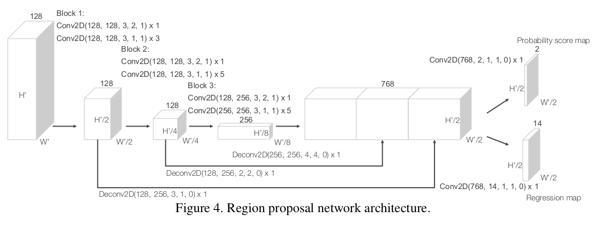

# Dataset

## [SUN3D](http://vision.princeton.edu/projects/2013/SUN3D/paper.pdf)

### Introduction

incorporate 3D reconstruction with 3D labeling, since you just need to label a single object, and after reconstructio, you can get all the labels in all the frames.  

Some resources:

1. RGB-D camera to prodeuce 3D models of spaces [10, 4, 15]  
2. Neuro Science [17] study finds that PPA(represent scenes and spatial layouts, has a view-specific representation ) and RSC (for navigation, route learning , has a place-centric representation ) are complementary.
3. Other 3D dataset : NYU Depth Dataset \ SUN[24]

### Capturing Process

this dataset can be viewed as **Point Cloud** , **3D object model**, **viewpoints of objects**, **bird's-eye view of room**.

Setup: sensor: ASUS Xtion PRO LIVE

Register Methods: We begin by matching key-points using SIFT and remove poor matches using the ratio test. With SIFT results,  we choose the **ones with valid depth values** , and use a 3-point-algorithm inside a RANSAC loop to find relative transformation. As for fillng te holes in depthm map, one approach is to use cross-bilateral [20] , OR TSDF(voxelize the space) [15].
  
Loop closure: Bag of Words ; Joint 2D , 3D bundle adjustment :
$$ min \sum_{c}\sum_{c \in V(c)}(||\tilde{x_{p}^{c}}-K[R_{c}|t_{c}]X_{p}||^{2} + \lambda ||\tilde{X_{p}^{c}} - [R_{c}|t_{c}X_{p}||^{2}) $$
$\tilde{X_{p}^{c}}$ and $\tilde{x_{p}^{c}}$ is the observed 3D(RGB-D), 2D point and $X_{p}$ is the ground truth 3D point. (bundle adjustment to minimize the error)

## Jacquard: A Large Scale Dataset for robotic Grasp Detection

### Introduction

SOTA methods include predicting the manually labeled grasp or evaluating the previuosly generated candidates and select the best one.

## VoxelNet

### Architecture

FLN(feature learning network): **Grouping** : group the points according to the voxel they reside in. Due to the disparity of point cloud in the space, a voxel will contain a variable number of points. **Random Sampling** : sample T points from voxels containing more that T points. This is due to the highly variable density throughout the space. **Feature Encoding**: Denote $V = \{ p_{i} = [x_{i}, y_{i}, z_{i}, r_{i}]^{T} \in R^{4} \}_{i=1,...,T}$ (maybe we can substitute r --> r,g,b). First the centroid is computed as ($v_{x}$,$v_{y}$, $v_{z}$). $V_{in} = \{ \hat{p_{i}} = [x_{i}, y_{i},z_{i}, r_{i}, x_{i} - v_{x}, y_{i} - v_{y}, z_{i} - v_{z} ]^{T} \in R^{7}  \}_{t=1,...,T}$, and each $\hat{p_{i}}$ is fed into a VEF Module.

VEF Module ( Linear Layer, Batch Norm, RELU, Maxpool ) to have point-wise information. Use element-wise maxpool across all $f_{i} \in V$ --> $\tilde{f} \in R^{m}$ *m is the feature channel* (perform on each channel) and aggregate the information: $f_{i}^{out} = [f_{i}^{T}, \tilde{f}^{T}]^{T} \in R^{2m}$. A VEF($c_{in}$, $c_{out}$) learn parameters $c_{in} * (c_{out} / 2)$.

After VEF, each voxel has a representing feature vector $f^{out} \in R^{c}$. Thus form a 4D tensor C * D * H * W. H, D, W is the voxel number along each dimension.

RPN network, as shown in the figure. Notice: After the middle convolution ($C*D*W*H$), reshape it to ($(C*D)*W*H$) and send to RPN.

Loss Function: 

#　Robots

## DroNet: Learning by Flying

### Structure

the first one --> steering angle is a regression, and the second --> collision probablity is an estimate of the uncertainty of the "steering angle". (that's why in Beauty and the Beast, they use the network to predict the variance of the Kalman filter input)

Considering the huge difference of the gradient from regression and classification, the loss:
$$ L_{total} = L_{MSE} + max(0,1-exp^{-decay(epoch-epoch_{0})})L_{BCE} $$
for proportion for classification increases along training.

### Experiment

Collecting the collision dataset: manually label the collected images as 0 (non-collision) and 1 (collision)

Test on DataSet : They use root-mean-squared error(RMSE) and explained variance ratio(EVA) to assess performance on collision prediction.

Real World Navigation: Test the model to fly through urban paths. The flying policy --> Minimize Probability of Collision Policy: choose the direction that minimizes the collision probability. Algorithm[10].

other extensions: [25] 3D-trajectory generation ; [26] estimation of distance;

### thoughts & cites

the reason to use resnet is because the resnet scheme is proposed to address the degradation problem generated by difficulties in network optimization.[18] This really enhance the performance and speed of the network.

problems caused by the two branch. The gradient of classification and regression varies, **so the weight for this two loss must balance the inherent difference of their gradient**.

paper [24] is used to explain the attention of the network, where does the drone focus on?  the author finds the drone relies on line-like features. (this may not suit our application)
