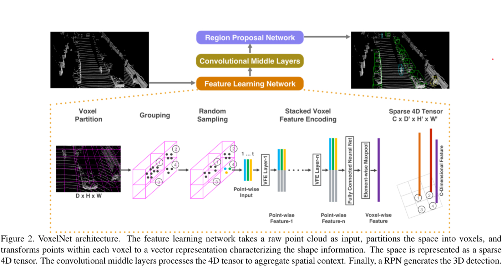
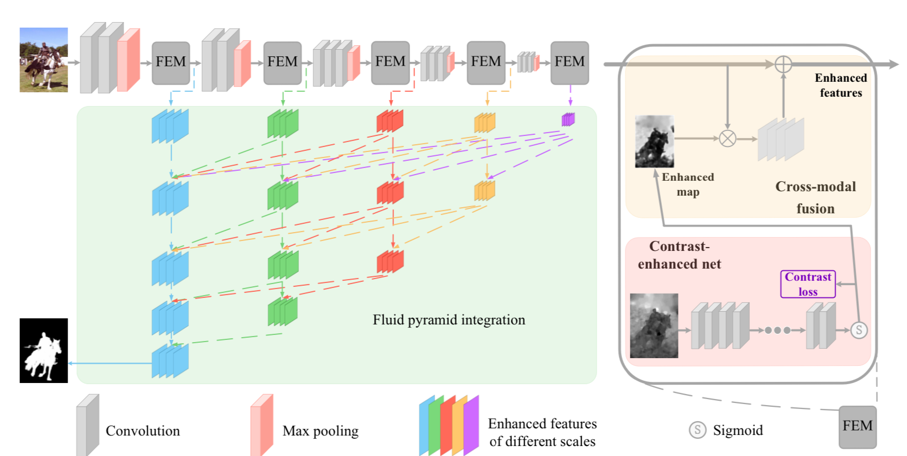

<!-- vim-markdown-toc GFM -->

- [Dataset](#dataset)
  - [SUN3D](#sun3d)
    - [Introduction](#introduction)
    - [Capturing Process](#capturing-process)
  - [Jacquard: A Large Scale Dataset for robotic Grasp Detection](#jacquard-a-large-scale-dataset-for-robotic-grasp-detection)
    - [Introduction](#introduction-1)
    - [Model Grasp](#model-grasp)
    - [Generate synthetic dataset](#generate-synthetic-dataset)
    - [Model Assessment](#model-assessment)
- [Object Detection](#object-detection)
  - [FCOS: Fully Convolutional One-Stage Object Detection](#fcos-fully-convolutional-one-stage-object-detection)
    - [Arch](#arch)
    - [Experiment](#experiment)
    - [Arguments](#arguments)
- [Monocular - 3D vision](#monocular---3d-vision)
  - [UnOS: Unified Unsupervised Optical-flow and Stereo-depth Estimation by Watching videos](#unos-unified-unsupervised-optical-flow-and-stereo-depth-estimation-by-watching-videos)
- [3D Vision](#3d-vision)
  - [VoxelNet: End-to-End Learning for Point Cloud Based 3D Object Dectection](#voxelnet-end-to-end-learning-for-point-cloud-based-3d-object-dectection)
    - [Intro](#intro)
    - [Architecture](#architecture)
    - [Experiment](#experiment-1)
    - [Arguments](#arguments-1)
  - [Part-A2](#part-a2)
    - [Intro](#intro-1)
      - [related work](#related-work)
    - [Arch](#arch-1)
    - [Argument](#argument)
    - [Code](#code)
  - [PointNet: Deep Learning on Point Sets for 3D Classification and Segmentation](#pointnet-deep-learning-on-point-sets-for-3d-classification-and-segmentation)
    - [intro](#intro-2)
    - [Arch](#arch-2)
    - [Experiment](#experiment-2)
    - [Argument](#argument-1)
  - [Frustum PointNets](#frustum-pointnets)
    - [Intro](#intro-3)
    - [Arch](#arch-3)
    - [Argument](#argument-2)
    - [Implementation](#implementation)
  - [PVN3D: A deep Point-wise 3D keypoint voting Network for 6Dof Pose Estimation](#pvn3d-a-deep-point-wise-3d-keypoint-voting-network-for-6dof-pose-estimation)
    - [Intro](#intro-4)
    - [Arch](#arch-4)
    - [Implementation](#implementation-1)
    - [Arguments](#arguments-2)
  - [Real-time Fruit recognition and Grasp Estimation for Autonomous Apple Harvestnig](#real-time-fruit-recognition-and-grasp-estimation-for-autonomous-apple-harvestnig)
    - [Summary](#summary)
    - [Arch](#arch-5)
  - [Contrast Prior and Fluid Pyramid Integration for RGBD Salient Object Detection](#contrast-prior-and-fluid-pyramid-integration-for-rgbd-salient-object-detection)
    - [Intro](#intro-5)
    - [Architeture](#architeture)
    - [Experiments and Dataset](#experiments-and-dataset)
    - [arguments](#arguments-3)
  - [Dense 3D Point Cloud Reconstruction Using a Deep Pyramid Network](#dense-3d-point-cloud-reconstruction-using-a-deep-pyramid-network)
    - [Intro](#intro-6)
    - [Arch](#arch-6)
  - [3D point cloud registration for localization using a deep nueral network auto-encoder](#3d-point-cloud-registration-for-localization-using-a-deep-nueral-network-auto-encoder)
    - [Intro](#intro-7)
- [Robots](#robots)
  - [DroNet: Learning by Flying](#dronet-learning-by-flying)
    - [Structure](#structure)
    - [Experiment](#experiment-3)
    - [thoughts & cites](#thoughts--cites)
  - [Real-time 3D Reconstruction on Construction site using Visual SLAM and UAV](#real-time-3d-reconstruction-on-construction-site-using-visual-slam-and-uav)
    - [Intro](#intro-8)
      - [Focal Loss](#focal-loss)

<!-- vim-markdown-toc -->

# Dataset

## [SUN3D](http://vision.princeton.edu/projects/2013/SUN3D/paper.pdf)

### Introduction

incorporate 3D reconstruction with 3D labeling, since you just need to label a single object, and after reconstructio, you can get all the labels in all the frames.  

Some resources:

1. RGB-D camera to prodeuce 3D models of spaces [10, 4, 15]  
2. Neuro Science [17] study finds that PPA(represent scenes and spatial layouts, has a view-specific representation ) and RSC (for navigation, route learning , has a place-centric representation ) are complementary.
3. Other 3D dataset : NYU Depth Dataset \ SUN[24]

### Capturing Process

this dataset can be viewed as **Point Cloud** , **3D object model**, **viewpoints of objects**, **bird's-eye view of room**.

Setup: sensor: ASUS Xtion PRO LIVE

Register Methods: We begin by matching key-points using SIFT and remove poor matches using the ratio test. With SIFT results,  we choose the **ones with valid depth values** , and use a 3-point-algorithm inside a RANSAC loop to find relative transformation. As for fillng te holes in depthm map, one approach is to use cross-bilateral [20] , OR TSDF(voxelize the space) [15].

Loop closure: Bag of Words ; Joint 2D , 3D bundle adjustment :
$$ min \sum_{c}\sum_{c \in V(c)}(||\tilde{x_{p}^{c}}-K[R_{c}|t_{c}]X_{p}||^{2} + \lambda ||\tilde{X_{p}^{c}} - [R_{c}|t_{c}X_{p}||^{2}) $$
$\tilde{X_{p}^{c}}$ and $\tilde{x_{p}^{c}}$ is the observed 3D(RGB-D), 2D point and $X_{p}$ is the ground truth 3D point. (bundle adjustment to minimize the error)

## Jacquard: A Large Scale Dataset for robotic Grasp Detection

### Introduction

SOTA methods include predicting the manually labeled grasp or evaluating the previuosly generated candidates and select the best one.

Summary:

1. Jacquard synthetic Dataset
2. SGT and other criterion for grasp evaluation

### Model Grasp

representation of a grasp is :
$$ g = {x,y,h,w,\theta} $$
This coordinate can be easily expressed in image coordinate system. As shown in the figure: 
 
z position and approach can be obtained through depth image.

### Generate synthetic dataset

generate scene description: select model, resize them, add mass and drop into the scene. 

Image rendering: render two more RGB images with a projected pattern and applied a stereo-vision algorithm [19] to them. (add noise)

Annotation Generation: generate thousands of potential grasps and perform trials in simulation. The distribution for grasp generation is concentrated around the aligned edges.

### Model Assessment

grasp criterion in Cornell Dataset (rectangle metrics):

1. angle between prediction and ground-truth is below a certain threshold.
2. IoU is over a threshold.

SGT (simulated grasp trial-based criterion) : rebuild the corresponding scene in the simulation environmnt to test whether a predicted grasp is good or not. (This may be the final test metrics)

# Object Detection

## FCOS: Fully Convolutional One-Stage Object Detection

Based on the FCN (fully convolutional network) framework. Other works are [20,28,9,19].

### Arch

For a feature map $F_{i} \in R^{H*W*C}$, any point $M_{i} = F(x,y)$ on the feature map (x,y) maps back to point $I(x,y) = ([\frac{s}{2}]+xs, [\frac{s}{2}]+ys)$ on original image. s is the total stride to this feature map. **Then directly regress the target at the location.** as [20].

If the point $M_{x,y}$ with its original point $I_{x,y}$ falls into the ground-truth box $B_{i} = (x_{0}, y_{0}, x_{1}, y_{1}, c)$ , it's considered as a positive sample. Otherwise, it's a negative sample. The regress target is coded as $\mathbf{\mathop{t^{*}}} = (l^{*}, t^{*}, r^{*}, b^{*})$. Four parametes are the distance between the point to the four sides of the ground truth box respectively. **If a point is in multiple ground-truth boxes, we choose the minimul area box as its ground-truth box**.
> The positive samples are more than anchor-based method. 
> This method is like predicting bounding boxes on the segmentation prior.

Loss function :  
classification : focal loss in [15]  
regression : IOU loss in [32] 

**Incorporate Features at Multiple Levels**: 在不同尺度的特征图下检测，网络结构如下图: 
 
{P3, P4, P5, P6, P7} are feature levels with stride 8,16,32,64,128。在不同尺度上限制一个范围$(m_{i-1}, m_{i})$，当预测的 bbox 超过这个范围则舍弃，作为负样本。

**Center-ness Loss**: supress the low-quality detected bounding boxes. (those far away from the center of a ground truth box)

As shown in the architecture figure, a centerness branch is added in parallel with the classification branch to predict the centerness of the predicted box. The target center-ness for the box is defined as follow:
$$ centerness = \sqrt{\frac{min(l^{*}, r^{*})}{max(l^{*}, r^{*})} * \frac{min(t^{*}, b^{*})}{max(t^{*}, b^{*})}} $$
$\{l^{*}, r^{*}, t^{*}, b^{*}\}$ is the distance to the ground truth box it belongs to. 0 --> corner of the box ; 1 --> center of the box. Use a binary cross entropy loss for it. This center loss can surpress those points at the corner of the bounding boxes. 

In the figure above, after multiplying center-ness on the classification score, high classification score with low IOU points are surpressed.
> this branch can also be added in parrallel with the regression block.

### Experiment

FCOS can replace RPN module in some networks.

### Arguments

检测是基于分割的，在每个点上预测目标的位置，虽然不需要anchor box, 但是产生的 bbox 确实有些多。

后面的 center-ness score 作为一种抑制边缘点的方法，能通过 threshold 或者 NMS 有效去除在物体边缘的预测点。减少 bbox 。

看了文章的(More discussion)之后，有些感想。一个是目前整合是一个方向，希望把所有的模块整合到卷积神经网络之中。本文的 center-ness 在另一篇文章中是一个独立的模块，这里将它整合到网络中。

# Monocular - 3D vision

## UnOS: Unified Unsupervised Optical-flow and Stereo-depth Estimation by Watching videos

# 3D Vision

## VoxelNet: End-to-End Learning for Point Cloud Based 3D Object Dectection

### Intro

Hand-crafted features are [39,7,8,19,40,33,6,25,1,34,2]; directly predict the 3D bounding box from 2D images [4,3,42,43,44,36]; d

related works are PointNet[29 ] and its improved version[30 ]

Summarize as below:

1. a novel end-to-end deep architecture --> VoxelNet, directly operates on sparse 3D points.
2. propose parallel processing methods for multiple voxels.

### Architecture

Three Functional blocks: 1) Feature Learning Network; 2) Convolutional Middle Layer; 3) RPN

FLN(feature learning network):  **Grouping** : group the points according to the voxel they reside in. Due to the disparity of point cloud in the space, a voxel will contain a variable number of points.  **Random Sampling** : sample T points from voxels containing more that T points. This is due to the highly variable density throughout the space.  **Feature Encoding**: Denote $V = \{ p_{i} = [x_{i}, y_{i}, z_{i}, r_{i}]^{T} \in R^{4} \}_{i=1,...,T}$ (maybe we can substitute r --> r,g,b). First the centroid is computed as ($v_{x}$,$v_{y}$, $v_{z}$). $V_{in} = \{ \hat{p_{i}} = [x_{i}, y_{i},z_{i}, r_{i}, x_{i} - v_{x}, y_{i} - v_{y}, z_{i} - v_{z} ]^{T} \in R^{7}  \}_{t=1,...,T}$, and each $\hat{p_{i}}$ is fed into a VEF Module.

VEF Module ( Linear Layer, Batch Norm, RELU, Maxpool ) to have point-wise information. Use element-wise maxpool across all $f_{i} \in V$ --> $\tilde{f} \in R^{m}$ *m is the feature channel* (perform on each channel) and aggregate the information: $f_{i}^{out} = [f_{i}^{T}, \tilde{f}^{T}]^{T} \in R^{2m}$. A VEF($c_{in}$, $c_{out}$) learn parameters $c_{in} * (c_{out} / 2)$.

After VEF, each voxel has a representing feature vector $f^{out} \in R^{c}$. Thus form a 4D tensor C * D * H * W. H, D, W is the voxel number along each dimension.

RPN network, as shown in the figure. Notice: After the middle convolution ($C*D*W*H$), reshape it to ($(C*D)*W*H$) and send to RPN.

Loss Function: the residue is computed first:
$$ \delta x = \frac{x_{c}^{g}-x_{c}^{a}}{d^{a}} \quad \delta y = \frac{y_{c}^{g} - y_{c}^{a}}{d^{a}} \quad \delta z = \frac{z_{c}^{g}-z_{c}^{a}}{d^{a}} $$
$g$ denotes the coordinates to the ground and $a$ denotes anchor, $d^{a}$ is diagonal of the base of the anchor.
$$ \delta l = log(\frac{l^{g}}{l_{a}}) \quad \delta w = log(\frac{w^{g}}{w^{a}}) \quad \delta h = log(\frac{h^{g}}{h^{a}}) $$
$$ \delta \theta = \theta ^{g} - \theta ^{a}$$
the regression output is:
$$ u = (\delta x, \delta y, \delta z, \delta l, \delta w, \delta h, \delta \theta)$$
and the ground truth label is parameterized as $u_{i}^{\star}$.　Total Loss:
$$ L = \alpha \frac{1}{N_{pos}}\sum_{i} L_{cls}(p_{i}^{pos}, 1) + \beta \frac{1}{N_{neg}} \sum_{i} L_{cls}(p_{i}^{neg}, 0) + \frac{1}{N_{pos}} \sum_{i} L_{reg}(u_{i}, u_{i}^{\star})$$
$u_{i}$ and $u_{i}^{\star}$ are relative to the positive anchor.
za
### Experiment

due to the sparsity of the point cloud, sparse tensor can accelerate the training process.

Detail : **details of network are in section 3.1**

**Implementation**: 在计算loss 的时候，将 ground truth 先换算到对应的 positive anchors (IoU > 0.6)上，得到一张 mask, 和回归的向量。计算 loss 的时候直接用mask 操作。

**Data Augmentation**: 是将物体的点云经由高斯分布产生的偏差移动后，检测是否与其他点重合来拓展数据。

### Arguments
Random Sampling from voxels (this is really like yolo, make grids on the whole picture)

这个网络有一些问题:

1. 所有的anchor是在同一个平面上。如同同一区域上方有多个物体，则最多预测２个。
2. 由于物体倾斜，计算 box overlap 时十分麻烦。
3. 对物体角度的回归，这是一个非线性的问题，主要在于$\theta$ 与 $\theta + 2\pi$ 的效果其实是一样的，但是采用 SmoothL1 loss 会产生很大的误差。我们可能需要一种更合适的误差函数。训练时，角度产生的误差是距离量误差的数十倍。这也可能是 PVN3D 将角度估计最后交给最小二乘去做了。

一种方法是直接用一个 bbox 将物体框起来，然后只用左上与右下坐标表示，计算 box overlap, 但是误差很大。另一种就是蒙特卡洛的方法，打点计算面积。由于相同的点在两个矩形中的坐标实际上就是一个H 变换。 
$$\vec{x} = c_{1}*\vec{\alpha_{1}} + c_{2}*\vec{\alpha_{2}} + \vec{t} = c_{1}'*\vec{\alpha_{1}'} + c_{2}'*\vec{\alpha_{2}'} + \vec{t'} \\ c_{1}, c_{2}, c_{1}', c_{2}' \in (0,1) $$
通过一个变换后检查是否在$(0,1)$范围内来求交。此方法消耗很大的计算量和内存。

优点：

1. 提出了一种方法，将稀疏的点云取样处理后，作为三维的张量输入网络中，与之前的二维目标检测框架融合。

2. RPN 网络将不同尺度上的特征图拼接后一起预测。与在不同尺度上直接预测相比，减少计算量。

感觉不同方法选择的优化器也不一样

## Part-A2

### Intro

**Intra-object part locations**: relative location of each foreground point with respect to the object box that it belongs to.

Summary, Part-A2 net consists of **part-aware stage(Stage-I)** for predicting accurate intra-object part locations and learning point-wise features, and the **Part-aggregation(Stage-II)** to improve the quality of predicted boxes.

1. Part-A2 , using the free-of-charge intra-object part information to learning discriminative 3D features and by effectively aggregating the part features
2. two strategies (anchor based & anchor free)
3. differential RoI-aware point cloud region pooling operation

#### related work

[42] propose the aggregated losses to improve the 3D Localization

* bird view map:

[1,4] project the point cloud to the bird view and extracted features from bird-view maps.

* feature fusion:

[5] explored feature fusion strategy ----> fusion layer.

[6,25] 2D object detectors to crop the point cloud. [27, 28] (PointNet)

[47] combine the multi-view RGB images and 3D point cloud to better generate proposals.

* Voxel only:

[7] propose Sparse Conv to improve VoxelNet (spconv in github)

[53] : Deformable Part-Based Models. [54, 55, 56]

### Arch

the relative location of points inside a bounding box provides information about the object shape. Because objects of the same class (like cars) may have the same distribution of points.

Then, the 3D intra-object part location labels and segmentation labels are aggregated in the second stage to score the boxes and refine their locations

first, voxelize the 3D space into regular voxels and extract the voxel-wise features by stacking **sparse convolution and sparse deconvolution**. The initial feature is simply calculated as the mean values of point coordinates within each voxel.

* Learning foreground segmentation and intra-object part location estimation

Intra-object location : the relative location in the 3D ground-truth bounding box that it belongs to. Then the regression is calculated with respect to the intra-object part location using BCE.

* 3D peoposal generation

Anchor-free

Bin-based center regression loss. The surrounding area along X and Y axes of each foreground point is plit into a series of bins to locate the object center.

将回归拆分为两部分，一个是 bin 分类，还有一个是残差的回归

$$
L_{bin}^{(p)} = \sum_{u \in {x,y,\theta}} (L_{ce}(\hat{bin_{u}^{(p)}}) + L_{smooth-L1}(\hat{res_{u}^{(p)}}, res_{u}^{(p)}) )
$$

$$
L_{res} = \sum_{z\in {z,h,w,l} } L_{smooth-L1}(\hat{res_{v}^{(p)}}, res_{v}^{(p)})
$$

In inference stage, regressed x,y and \theta are obtained by first choosing the bin center with the highest predicted confidence and then adding the predicted residuals.

* box refinement

将预测中所有点的坐标（相机系）变换到物体系中的坐标作为下一步池化的输入

池化相当于是将一个 proposal 中的点 voxelize 成 X * Y * Z * C 的四维张量。

对位置信息，也就是之前说到的 intra-object location 采用 average pooling 而提取的特征采用 max pooling .之后将两者拼接 (G submanifold sparse convolution layer ?)。后面的过程不详述。值得注意一点在于，他们将 empty voxel 保留，作为 0 输入，而不是在 PointNet 中直接舍弃。

### Argument

在 Introduction 中，作者提到了一个三维检测中之前未注意到的问题，就是三维的标注不会重叠。(物体不会碰撞) 这可以采用一些二维检测中无法使用的方法。---->  intra-object part locations ，从数据本身的特点出发，提出想法。

这篇文章发现，相同类的物体中，点云的分布状况应该是相近的 (what about using histogram ?)

后面的 bin 回归想法不错，将原本回归误差较大的边缘点变成分类的 CE 和残差的回归，而这两者的误差大小相近，在一定程度上缓解了多任务学习不均衡问题。

有意思地方在 \theta 的 anchor 值设置，是取了两者差的正弦值。

一个 refinement 在得到的 proposal 中继续提取特征，进行参数微调。这里就利用率之前提到的 intra-object location .

### Code

计算 intra-object part location loss 是在 UnetV2 get_loss 中。计算

## PointNet: Deep Learning on Point Sets for 3D Classification and Segmentation

### intro

Summary:

1. novel deep net architecture for unordered point sets in 3D
2. empirical and theoretical analysis on the stability and efficiency of our method.
3. Intuitive explanations for its performance.

**The Problem of processing unordered sets by neural nets is a very fundamental and general problem. We expect that our ideas can be transferred to other domains as well.**

[25] first looks into this problem --> Deep Learning on Unordered Sets. They use a read-process-write network with attention mechanism to consume unordered input sets.

### Arch

approximate a general function defined on a point set by applying a symmetric function on transformed elements in the set:
$$ f(\{x_{1}, ..., x_{n}\}) = g(h(x_{1}), ..., h(x_{n})) $$
from a point set to a real number. $h(x)$ --> mlp, $g$ max pooling layer.
> That's what VEF layer does in VoxelNet.

The idea of aligning 3D space is extended to feature space. (which originally is from STN) They apply a affine matrix ($A \in R^{64*64}$) in the feature space, (shown in the figure). A regularization loss is added to $A$ :
$$ L_{reg} = ||I - AA^{T} ||^{2}_{F} $$
> 还是希望A 尽量为正交阵, keep the length of feature vector.　这也是拉格朗日乘数法的一个思想，把约束项放到优化项里面。

**Local and Global Information Aggregation**: After we get the output $[f_{1}, ..., f_{K}]$, which is a global feature, we concatenate it directly after the local feature point to aggregate imformation globaly and locally. 

**Theoretical Analysis**

function $h$ and $g$ can approximate any continuous set function $f$, as in the worst case, the network can learn to conveert a point cloud into a volumetric representation. (voxelize way)

Robustness of the network. $f(S)$ is unchanged as long as a critical point set $C_{S}$ is preserved. The number of elements in $C_{S}$ is less or equal to K (dimension(or neurons) of max function)
> 既然只受到 critical points 限制，我们能不能用这来做点云压缩？

### Experiment

**Data Augmentation**: jitter the position of each point by a Gaussian noise with zero mean and 0.02 standard deviation. 
> a small gap between PointNet and MVCNN[23] multiview - CNN

### Argument

Point Net 与 Voxel Net 采取两种方式解决点云问题。前者是基于在 ordered set 上处理问题的思想，后者则是 Voxelize/grid　思想。

文章 sec 4.1 的讨论很好。但是我觉得 Voxelize 可以有效解决这三点....，但是 Voxelize 占用很大的内存，这也是 VoxelNet 提出 sparse operation 缘故。

之后引出 Symmetric Function. 由于模型需要对输入变换保持不变性，[the net needs to be invariant to N! permutations of the input set]，所以对输入三种处理:

1. sort. (lose spatial information)
2. RNN method, augment the input by permutation [25, "OrderMatters"]
3. use symmetric function to aggregate information.

后面的在特征空间中加上一个变换之前还没有见过。而且觉得很奇怪，正交变换不会丢失特征信息（应该是指秩不改变？）或者应该是找到一个更好的分解基底，最后用$L_{reg}$ 松弛约束。
> 其实对深度学习对矩阵的约束很复杂。比如要求为正交阵，或者要求秩。如果能够找到像李代数这样能将约束化为无约束的数学工具，也是一大改进。

看他的理论分析发现，其实最差情况下就是 voxelize 方法。所以 VoxelNet 其实是在前面用 PointNet 的思想，优化了部分网络结构。

[25](https://arvix.org/abs/1511.06391) 是关于序列的一篇好文。

## Frustum PointNets

### Intro

### Arch

Motivation for frustum : resolution of data produced by 3D sensors is lower than RGB images.

* Frustum Proposal

2D bounding boxes can be lifted to a frustum that defines a 3D search space for the object. We then collect all points within the frustum to form a frustum point cloud.

* 3D instance segmentation

Since occluding objects and background clutter is common in natural scenes, it's better to seperate 3D object in physical space. Similar to Mask-RCNN, we realize 3D instance segmentation using a PointNet-based network.

The classification result from FPN (2D detector) can indicate the shape of object of interest. We encode the sematic category as a one-hot class vector and concatenate the one-hot vector to the intermediate point cloud features.

For coordinate to estimate the pose the object 

regression model --> T-Net

### Argument

2D detector 的分类结果做成 one-hot vector 直接拼接在点云特征后，作为点云检测的输入信息。希望网络能通过分类大体得到物体的形状。

后面的 residual approach 与 PCDet 中的 bin loss 是相似的，划分成 bin 后再计算 residual 的误差。

### Implementation

在裁剪位于 2D bbox 中的点云时，是将所有的点云投影到照片平面上，并将物体的 bbox 投影到相机平面上，获取那些位于物体 bbox(2d) 中的点云的 index 在原点云中获取。

数据处理中：

1. box3d_pts_3d 物体在三维空间８顶点三维坐标
2. pc_in_box_fov reference frame 中的位于检测框内的点
3. label pc_in_box_fov 中实际为目标的点
4. type_list class
5. heading_angle 是物体自身绕 y 轴偏角
6. frustum_angle frustum rotation 对应的偏角

## PVN3D: A deep Point-wise 3D keypoint voting Network for 6Dof Pose Estimation

### Intro

Summary:

1. Use **Deep Hough** voting network to detect 3D Key points of objects and Estimate the 6D pose parameters within a least-squares fitting manner.
2. analysis of the boost from training 3D-key point and sematic segmentation jointly. 

Analysis of the problem -- 6 Dof estimation

| 方法 | 分析 | 例子 |
| ---- | ---- | ---- |
|regress rotation and translation directly | non-linearity of the rotation space. [37] | 1. post-refinement procedure [26,50]  2. discrete the rotation space and regard it as a classification problem. |
|detect 2D key points & PnP [46,41,47] | 1. Small error in projection leads to huge error in real 3D space. 2. overlap of 3D keypoints. 3. loss of geometric constraint information. | 1. heat maps to locate 2D Points[33,24,34]   2. pixel-wise voting network to vote for 2D Key point location.[37]  3. [46] extract two views of synthetic RGB images to recover 2D poses. |
| Dense Correspondence Methods:   extract features and predict the corresponding 3D object coordinates for each pixel. | advantage : robust  disadvantage: large output space. |  random forest [3,32] and  CNNs [23,9,27] to extract features. 

### Arch

**Feature Extraction and Fusion** --> **3D Keypoint Detection** <--> **Instance Semantic Segmentation**

**3D Keypoint Detection**:$M_{K}$

forward : predicts the per-point euclidean translation offset from visible points to target keypoints. These visible points (with the translation) vote for the target points. The voted keypoints are then clustered and the centers of clusters are the voted key points. 

Details of **3D Detection Module**: we have a set of visible points ${p_{i}}_{i=1}^{N}$ with its features ${f_{i}}_{i=1}^{N}$ and a set of selected keypoints ${kp_{i}}_{j=1}^{M}$. The network predicts the translation offset of each visible points ${of_{i}^{j}}_{j=1}^{M}$ (offset of visible point i to keypoint j). The voted keypoint can be denoted as $vkp_{i}^{j} = x_{i} + of_{i}^{j}$. Supervision is :
$$ L_{keypoints} = \frac{1}{N} \sum_{i=1}^{N} \sum_{j=1}^{M} ||of_{i}^{j} - of_{i}^{j*}|| 1(p_{i} \in I) $$
Where $of_{i}^{j*}$ is the ground truth keypoints. $1$ is the indicator function for we just calculate the points belonging to the same instance.

**Instance Segmentation**: $M_{S}$

$M_{S}$ is an point-wise instance semantic segmentation module. Given the per-point extracted feature, $M_{S}$ predicts per-point semantic labels. We use [FocalLoss](#FocalLoss) as loss function.

**Center Voting Module**: $M_{C}$

$M_{C}$ takes in the per-point feature and predict the Euclidean translation offset $\delta \vec{r_{i}} $ to the center of object it belongs to. Loss function is **L1 Smooth Function**.

**Least Square Fitting**:

After clustering all the points, we obtain sets of detected objects. Given a point set of predicted key points in camera-coordinate system and corresponding set of points on the object coordinate system, they use least-square to find the rotation and translation.
$$ L_{least_square} = \sum_{j=1}^{M}|| kp_{j} - (R*kp_{j}' + t)||^{2} $$

### Implementation

### Arguments

这里也写些和论文写作相关的。看了这么多论文，也能察觉出一些基本的写作套路。

1. hand-craft features, 大多数文章会从这里开头，猛批之前的方法。再由此引出最近的深度学习。分析现有方法的优缺点，最后提出自己的方法，并且给出全文的概括。

这里的 **Instance Segmentation** 和 **Center Voting Module** 和之前看到的 **FCOS** 模型直接在像素点上的检测有着相同之处。

这篇文章将姿态预测和分类拆分开来，应该还是考虑到之前所说的旋转空间中的非线性问题。之后整合进入一个网络也是可以考虑的。比如说把 g2o 整合到网络中，采用李代数优化。

## Real-time Fruit recognition and Grasp Estimation for Autonomous Apple Harvestnig

### Summary

Fruit harvest system:

1. fruit recognition block : a one-stage multi-task neural network --> fruit detection and instance segmentation
2. grasp pose estimation : incoorperate fruit recognition and depth images to estimate poses.

### Arch

RGB --(recognition block)--> fruit instance --(back project)--> point cloud of instance --(PointNet)--> estimate geometry & pose

pose estimation uses Frustum PointNets [50] 

## Contrast Prior and Fluid Pyramid Integration for RGBD Salient Object Detection

### Intro

Salient object detection : distinguish the most distinctive obeject in the scene. Works to utilize the depth image in DNN [4]. In image segmentation [17, 40] ; object recognition [46 ]; visual tracking [3]

methods to use depth information: concatenate depth feature map with RGB feature map at early/middle/late stage.  This fails due to :

1. Shortage of high quality map : depth maps are much noiser and textureless than RGB
2. depth and RGB have very different properties. (color in each image has differnet "meaning") Simple fusion like linear combination and concatenation fails. 

instances of these methods are [4, 18, 20, 49, 27, 28, 55]. **The author proposes to use the contrast prior to enhance the depth map. Then the depth map is used as an attention map.**
>contrast proir is proposed in [4, 18, 20, 49]; Notice , [2] is the benchmark of salient object detection; [11,50] are neural evidence for the contrast prior.

Summary as below:

1. a contrast loss is designed to utiliza the contrast prior, for depth map enhancement.
2. fluid pyramid integration is proposed to make use of multi-scale cross-modal features.

### Architeture

the whole net is shown as below:

the skeleton is VGG-16 (its first 5 blocks), and embed a FEM at the end of each block. The FEM ( Feature-enhanced Module ) : CEN & Cross-Modal fusion. The architecture of the CEN is repeats of the blocks --> conv(4,32,2) + conv(3,32,1) + RELU. *conv(kernel_size, number_of_channels, stride)* The block is repeated untill the feature map holds the same size with the RGB feature map counterpart. Then, two more convolutional layers are followed. (conv(3,32,1) + conv(3,1,1) + sigmoid) *then output looks like a prediction(pixel-wise)*

CEN (Contrast-enhanced Net) [inspired by 14],  utilize the contrast between foreground and background as well as uniform distribution in the foreground. Contrast loss is composed of foreground object distribution loss $l_{f}$ , background distribution loss $l_{b}$, whole depth image distribution loss $l_{w}$.
$$ l_{f} = -log(1-4*\sum_{(i,j) \in F} \frac{(p_{i,j}-\hat{p_{f}})^{2}}{N_{F}} )$$
$$ l_{b} = -log(1-4*\sum_{(i,j)\in B} \frac{(p_{i,j}-\hat{p_{f}})^{2}}{N_{B}} )$$
$l_{f}$ and $l_{b}$ **are to make the enhanced map coherent with the original depth map for both foreground and background objects**. F and B are foreground and background region in the image. $\hat{p_{f}}$ and $\hat{p_{b}}$ are the mean value in foreground and background respectively.$l_{w}$**is designed to enhance the difference of foreground and background**
$$l_{w} = -log(\hat{p_{f}} - \hat{p_{b}})^{2}$$
And the **Contrast Loss** is :
$$ l_{c} = \alpha_{1} l_{f} + \alpha_{2} l_{b} + \alpha_{3} l_{w}$$

Cross-modal fusion: the enhanced map is one-channel, similar to an attention map[21, 25]. The RGB feature map is enhanced according to this enhanced map through multiplication, and then adds to the original map.

FPI(Fluid Pyramid Integration): take the output from each FEM, upsample the following tier to the current tier size, then add them. The top node of the pyramid is sent to a transition convolution layer and a sigmoid layer to get the final saliency map P. **This structure leads all the high-level features into low-level features, and integrates information both in multi-scale level and cross-modal level.**
> The comparison is with [4, 55, 36]

The **Total Loss** is:
$$ L = l_{s} + \sum_{i=1}^{5} l_{c_{i}} \qquad l_{s} = YlogP + (1-Y)log(1-P)$$
$l_{s}$ is the cross-entropy loss computed with the predicted saliency map and the ground truth saliency map. $l_{c_{i}}$ is contrast loss in the i th feature enhance module.

### Experiments and Dataset

Dataset : NJU2000 [32 ] and NLPR [12 ]

Metric: F-measure
$$ F_{\beta} = \frac{(1+\beta^{2})Precision*Recall}{\beta^{2}*Precision+Recall}$$
and Mean Average Error(measure the difference between two maps):
$$ \epsilon = \frac{1}{W*H} \sum_{x=1}^{W} \sum_{y=1}^{H} |P(x,y)-Y(x,y)| $$
S-measure [14 ]:
$$ S_{measure} = \alpha * S_{o} + (1-\alpha)*S_{r}$$

### arguments

the integration method (depth and RGB) is novel. I think this can be used as a preprocess on the depth image

## Dense 3D Point Cloud Reconstruction Using a Deep Pyramid Network

### Intro

We use surface voxel to represent 3D structure. This represntation is suffered from disparity. Use voxel to fill the volumn to represent the object is inefficient because the surface to volumn ratio decreases as the object gets bigger.

Current point cloud construction drawbacks:

1. the dense construction is heavy for upcoming network process.
2. Formulation would be memory and time consuming.

DensePCR predicts point clouds of increasing resolution. First predict a coarse point cloud from single-view image. Second, super resolve it.

[6] learnt a joint embedding of 3D voxel shapes and their corresponding 2D images. (image - shape bound);  [3] recurrent neural network to encode imformation from more than one views. *octree data structure* [25,22,21,9,28].  [5] generating unordered point clouds to obtain single-view 3D reconstruction.

For hierarchical prediction: 
[4] GAN to generate realistic images based on a Laplacian pyramid framwork. 
[13] improve [4] by introducing loss formulation and making modifications. 
[9] octree-based method for hierarchical surface reconstruction. 

### Arch

Metric : Chamfer Distance (CD)
$$ \begin{aligned}
d_{Chamfer}(\hat{X_{p}}, X_{p}) &= \sum\limits_{x \in \hat{X_{p}}} \mathop{min}\limits_{y\in Y_{p}}||x-y||_{2}^{2} \\
								&+ \sum\limits_{y \in \hat{Y_{p}}} \mathop{min}\limits_{x\in X_{p}}||x-y||_{2}^{2} \end{aligned}$$
As shown in the formula, CD tries to find the nearest neighbour and  calculate distance between them. This will lead to the cluster of other points.

Earth Mover's distance (EMD):
$$ d_{EMD}(\hat{X_{p}}, X_{p}) = \mathop{min}\limits_{\phi : \hat{X_{p}} -> X_{p}} \sum\limits_{x\in \hat{X_{p}}}||x - \phi(x)||_{2}$$
this metric needs to find a bijection mapping, which enforces uniformity but computationally.

## 3D point cloud registration for localization using a deep nueral network auto-encoder

### Intro

Methods to analyze point cloud data[1]. relating SLAM tech[3,4]. 3D reconstrution of scenes[5].

This paper focuses on localization techniques that rely on **registering large-scale point cloud** and a small point-cloud scanned within a scene at different times. The transformation between small point cloud (local point cloud) and large-scale point cloud (global point cloud) determines the position of camera.

registration of point clouds. Iterative Closest Point (ICP) [18], correlation of Extended Gaussian Images in the Fourier Domain[20].

# Robots

## DroNet: Learning by Flying

### Structure

the first one --> steering angle is a regression, and the second --> collision probablity is an estimate of the uncertainty of the "steering angle". (that's why in Beauty and the Beast, they use the network to predict the variance of the Kalman filter input)

Considering the huge difference of the gradient from regression and classification, the loss:
$$ L_{total} = L_{MSE} + max(0,1-exp^{-decay(epoch-epoch_{0})})L_{BCE} $$
for proportion for classification increases along training.

### Experiment

Collecting the collision dataset: manually label the collected images as 0 (non-collision) and 1 (collision)

Test on DataSet : They use root-mean-squared error(RMSE) and explained variance ratio(EVA) to assess performance on collision prediction.

Real World Navigation: Test the model to fly through urban paths. The flying policy --> Minimize Probability of Collision Policy: choose the direction that minimizes the collision probability. Algorithm[10].

other extensions: [25] 3D-trajectory generation ; [26] estimation of distance;

### thoughts & cites

the reason to use resnet is because the resnet scheme is proposed to address the degradation problem generated by difficulties in network optimization.[18] This really enhance the performance and speed of the network.

problems caused by the two branch. The gradient of classification and regression varies, **so the weight for this two loss must balance the inherent difference of their gradient**.

paper [24] is used to explain the attention of the network, where does the drone focus on?  the author finds the drone relies on line-like features. (this may not suit our application)

## Real-time 3D Reconstruction on Construction site using Visual SLAM and UAV

### Intro

photogrammetry has advantages like texture rich, low-cost and light weighted. Although the noise floor of image based 3D model is nearly three times higher that Lidar, the density points is much larger, which shows a better representation.

General framework for visual slam: Visual simultaneous localization and mapping: a survey ; "Appearance-based loop closure detection for online large-scale and long-term operation" & "Online global loop closure detection for large-scale multi-session graph-based slam"

#### Focal Loss

Focal Loss 是在原有的交叉熵函数上改进。交叉熵为：
$$ L = -ylogy'-(1-y)log(1-y') $$
Focal Loss:
$$ L_{fl} = \left\{
\begin{aligned}
-\alpha(1-y')^{\gamma}logy' & y=1 \\
-y'^{\gamma}log(1-y') & y=0 \end{aligned} \right$$
调节$\gamma$使函数对错分的样本的损失函数值更大，模型更加关注错分的样本。而正确分类的样本损失值会变小。平衡因子$\alpha$ 平衡正负样本之间的数量。避免由于负样本占主导。
