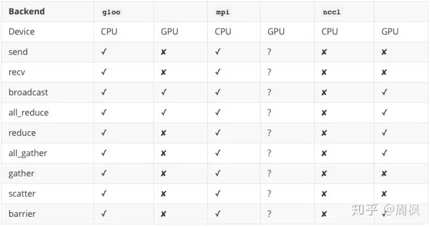

# RNN

对信息的理解可以分为时域， x(t), x(t+1), ... ; 或者空域(图片), I(row), I(row+1), ...

定义 ：

```python
TIME_STEP = 28
# each input size (like a row in a image)
INPUT_SIZE = 28
```

网络(分类)

```python
self.rnn = nn.LSTM(
    input_size 
    hidden_size  # rnn 中的隐藏层, 也是输出维度
    num_layers
    batch_first  # 确定batch 维度  (batch_size, time_step,input_size)
)
self.out = nn.Linear(input_size, output_size)

r_out, (h_n, h_c) = self.rnn(x, None)
# (h_n, h_c) "主线的记忆", None 初始时刻的hidden state
out = self.out(r_out[:,-1,:])  # r_out (batch, time_step, input_size)
```

相当于一次输入中 (time_step, input_size) 通过 rnn 后自动调用。

而下一个 batch_sample 时上一次的记忆则无效(没有采用hidden_state)

回归

```python
# 网络相同
def forward(self,x,hidden_state):
    r_out, hidden_state = self.rnn(x, hidden_state) # hidden_state 不断更新
    # hidden_state (n_layers, batch, hidden_size)
    outs = []    # save all predictions

    for time_step in range(r_out.size(1)):    # calculate output for each time step
        outs.append(self.out(r_out[:, time_step, :]))
    return torch.stack(outs, dim=1), h_state
```

since it's regression, it returns the prediction at each time step

train

```python
h_state = None      # for initial hidden state

for step in range(100):
    prediction, h_state = rnn(x, h_state)   # rnn output
    # !! next step is important !!
    h_state = h_state.data        # repack the hidden state, break the connection from last iteration
```

不断更新 hidden_state

# encoder - decoder 

本质上信息的压缩与解压，利用压缩的信息训练神经网络

decoder 涉及到 反卷积之类的操作

# Auto-grad

尽量减少对矩阵的直接赋值(其实赋值的话根本没办法算梯度)，最好是生成一个常数矩阵，与原矩阵做加减乘除运算达到目的(比如筛选); pytorch 反向传播支持赋值操作。

optimizer 的 zero_grad 只需要运行一次即可

自定义操作：

```python
class BinarizedF(Function):
    @staticmethod
    def forward(ctx, input_):  # 注意这里 ctx  的使用
        ctx.save_for_backward(input_)
        a = torch.ones_like(input_)
        b = -torch.ones_like(input_)
        output = torch.where(input_ >= 0, a, b)
        return output

    @staticmethod
    def backward(ctx, output_grad):
        input_, = ctx.saved_tensors
        input_abs = torch.abs(input_)
        ones = torch.ones_like(input_)
        zeros = torch.zeros_like(input_)
        input_grad = torch.where(input_abs <= 1, ones, zeros)
        return input_grad

class Binarized(torch.nn.Module):
    def __init__(self):
        super(Binarized, self).__init__()

    def forward(self, input_):
        return BinarizedF.apply(input_)
```

自定义处理层，实现backward 处理。 从auto_grad 中继承 Function 实现 forward & backward

再继承 nn.Module， 实现 forward, 就与一般的神经网络层一致了

在各层中监控输入输出　（hook 机制）

```python
def printnorm(self, input, output):
    # input is a tuple of packed tensor
    # output is a Tensor, whose data is the interest
    print('input size : ', input[0].size()) # input[0] is the input tensor

net.conv2.register_forward_hook(printnorm) # when call forward, the function will be called

def printgrad(self, grad_input, grad_output):
    # input and output are tuples
    print('grad_input size : ', grad_input[0].size())
    print('grad_output size : ', grad_output[0].norm())

net.conv2.register_backward_hook(printgrad) 
```

训练时，有时会只训练一部分参数（分阶段训练），关于 `requires_grad`官方文档
>If there's a single input to an operation that requires gradient, its output will also require gradient. Conversely, only if all inputs don't require gradient, the output also won't require it.

```python
model = torchvision.models.resnet18(pretrained=True)
for param in model.parameters():
	param.requires_grad = False
model.fc = nn.Linear(512,100)
# optimize only the classifier
optimizer = optim.SGD(model.fc.parameters(), lr=0.02)
```

# Multi-GPU 

采用 "cuda:%d" 方法指定GPU

```python
cuda1 = torch.device("cuda:1")
data = data.to(cuda1)
```

多线程：(具体教程见<https://pytorch.org/tutorials/intermediate/dist_tuto.html> 和 <https://mp.weixin.qq.com/s/hVcgcMYf9AaCHJ_2F-VyZQ> )

1. pytorch.nn.distributed

```python
# setup environment
def setup(rank, world_size):
    os.environ['MASTER_ADDR'] = 'localhost'
    os.environ['MASTER_PORT'] = '12355'
    dist.init_process_group("gloo", rank=rank, world_size=world_size)
    torch.manual_seed(42)
# clean up environment
def cleanup():
    dist.destroy_process_group()
# 具体的训练过程， world_size 是总共的线程数
def train(rank, world_size):
    setup(rank, world_size)
    ...
    cleanup()
# main 中调用
def run_multi(fn, world_size):
    mp.spawn(fn, args=(world_size,), nprocs=world_size, join=True)

if __name__ == '__main__':
   run_multi(train, 4)

# 还有一个进程间通信的方法
def average_gradient(model):
    size = float(dist.get_world_size())
    for param in model.parameters():
        dist.all_reduce_multigpu([param.grad.data], op=dist.ReduceOp.SUM)  # 将所有进程中 Tensor 求和并存储于个进程中
        param.grad.data /= size
```

save and load : 初始化的时候，将一个线程中的模型随机初始化并保存，然后其余线程导入这个模型

保存时，只需要保存一个线程中的模型 (一般为 rank 0)

多进程概念：

group : 进程组， 也是一个 world , 可以采用 new_group 接口创建 world 的子集

local_rank : 每个进程内 GPU 编号, 由 torch.distributed.launch 决定

流程 ：

1. 在使用 distributed 包的任何其他函数之前，需要使用 init_process_group 初始化进程组，同时初始化 distributed 包。

2. 如果需要进行小组内集体通信，用 new_group 创建子分组

3. 创建分布式并行模型 DDP(model, device_ids=device_ids)

4. 为数据集创建 Sampler

5. 使用启动工具 torch.distributed.launch 在每个主机上执行一次脚本，开始训练 (optional)

6. 使用 destory_process_group() 销毁进程组

## TCP 初始化

不同主机上多 GPU 训练(TCP 方式)：

```python
import torch.distributed as dist
import torch.utils.data.distributed

# ......
parser = argparse.ArgumentParser(description='PyTorch distributed training on cifar-10')
parser.add_argument('--rank', default=0,
                    help='rank of current process')
parser.add_argument('--word_size', default=2,
                    help="word size")
parser.add_argument('--init_method', default='tcp://127.0.0.1:23456',
                    help="init-method")
args = parser.parse_args()

# 初始化组中第rank个进程, icp 方法下所有 ip:port 必须与主进程保持一致
if mp.get_start_method(allow_none=True) is None:
    mp.set_start_method('spawn')
dist.init_process_group(backend='nccl', init_method=args.init_method, rank=args.rank, world_size=args.word_size)

# the sampler process, DS 将数据集划分为几个互不相交的子集
trainset = torchvision.datasets.CIFAR10(root='./data', train=True, download=download, transform=transform)
train_sampler = torch.utils.data.distributed.DistributedSampler(trainset)
trainloader = torch.utils.data.DataLoader(trainset, batch_size=batch_size, sampler=train_sampler)

# ......
net = Net()
net = net.cuda()
net = torch.nn.parallel.DistributedDataParallel(net)
```

每台主机上可以开启多个进程。但是，若未为每个进程分配合适的 GPU，则同机不同进程可能会共用 GPU，应该坚决避免这种情况。

直接用 python 解释器启动各个脚本

## ENV 初始化

```python
import torch.distributed as dist
import torch.utils.data.distributed

# ......
import argparse
parser = argparse.ArgumentParser()
# 注意这个参数，必须要以这种形式指定，即使代码中不使用。因为 launch 工具默认传递该参数
parser.add_argument("--local_rank", type=int)
args = parser.parse_args()

# ......
dist.init_process_group(backend='nccl', init_method='env://')

# ......
trainset = torchvision.datasets.CIFAR10(root='./data', train=True, download=download, transform=transform)
train_sampler = torch.utils.data.distributed.DistributedSampler(trainset)
trainloader = torch.utils.data.DataLoader(trainset, batch_size=batch_size, sampler=train_sampler)

# ......
# 根据 local_rank，配置当前进程使用的 GPU
net = Net()
device = torch.device('cuda', args.local_rank)
net = net.to(device)
net = torch.nn.parallel.DistributedDataParallel(net, device_ids=[args.local_rank], output_device=args.local_rank)
```

启动方式

```bash
python -m torch.distributed.launch --nproc_per_node=2 --nnodes=3 --node_rank=0 --master_addr="192.168.1.201" --master_port=23456 env_init.py
```

创建 nnodes 个node, 每个 node 有 nproc_per_node 个进程(一般为 GPU 数量)，每个进程独立执行脚本训练。 node rank 确定节点的优先级, 以 0 为主节点，使用其 addr:port 作为 master 的参数 (可以用为局域网内训练), 会自动分配 node 内的各线程优先级 (local_rank)

## 可选后端


## 进程间通信操作

multigpu 代表不同进程间，不同 GPU 上有 shape 相同的 Tensor, 可以通过此求和，求平均。

torch.distributed.new_group 可以将各优先级的进程组建成新组，在这些新组中进行后面的组间信息交流。返回一个 group object

## Template

在 [PCDet](https://github.com/RPFey/PCDet) 中可以使用 distributed training.

# pytorch Tutorials

## Data preparation

torch.utils.data.Dataset is a abstract class , following methods should be override. `__len__` & `__getitem__` . Typically, the path and txt setup is in `__init__` and image reading is in `__getitem__`。 `collate_fn` parameter in DataSet : this function is called when the batch is gathered (value has been returned by the `__getitem__` method and combined), so the input is a tuple.

```python
class MyDataSet(Dataset):
	def __init__(self, root_dir, csv_file, transform=None):
	"""
		the csv file contains thr images name
	""" 
	self.root_dir = root_dir
	self.transform =transform # this may a function
	self.label = pd.read_csv(csv_file) # read the label txt
	# the preprocess of data or its organization can follow
	
	def __len__(self):
		return len(self.label)
	
	def __getitem__(self, idx):
		if torch.is_tensor(idx):
			idx = idx.tolist()
		img_name = o.path.join(self.root_dir, self.label.iloc[idx, 0 ]) # column 1 is the name
		img = io.imread(img_name)
		labels = self.label[idx, 0]
		labels = np.array(labels).astype(np.float32).reshape(...) 
		sample = {'image':image, 'labels':label}
		if self.transform :
			sample = self.transform(sample)
		return sample
```

## Visualization

tensorboard

```python
from torch.utils.tensorboard import SummmaryWritter
writer = SummaryWriter('runs/test') # construct a writer

# for a given image
img_grid = torchvision.utils.make_grid(images)
writer.add_image('batch_images', img_grid) # show the images in a batch
# add network
writer.add_graph(net, input)
writer.close()

# add projector to visualize data
def select_n_random(data, labels, n=100):
    assert len(data) == len(labels)
    perm = torch.randperm(len(data))  # shuffle the index
    return data[perm][:n], labels[perm][:n]

images, labels = select_n_random(trainset.data, trainset.targets)
class_labels = [classes[lab] for lab in labels]
features = images.view(-1, 28*28)
writer.add_embedding(features,
                    metadata=class_labels,
                    label_img=images.unsqueeze(1))

# the add_scalar can show the chne of scalar(the mean loss of 1000 batch)
```

# Docs

## nn Module

*   nn.Parameter

nn.Module 类中有一个方法是 .parameters() (每次给优化器传参时)，会返回包含模型中所有 Parameter 对象的迭代器。

```python
class Net(nn.Module):
    def __init__(self):
        super(Net, self).__init__()
        self.weight = nn.Parameter(torch.tensor([1.0, 1.0]))

net = Net()
for param in net.parameters():
    print("param", param)
```

*   修正梯度

```python
def clip_grad_norm_(parameters, max_norm, norm_type=2):
    r"""Clips gradient norm of an iterable of parameters.

    The norm is computed over all gradients together, as if they were
    concatenated into a single vector. Gradients are modified in-place.

    Arguments:
        parameters (Iterable[Tensor] or Tensor): an iterable of Tensors or a
            single Tensor that will have gradients normalized
        max_norm (float or int): max norm of the gradients
        norm_type (float or int): type of the used p-norm. Can be ``'inf'`` for
            infinity norm.

    Returns:
        Total norm of the parameters (viewed as a single vector).
    """
    if isinstance(parameters, torch.Tensor):
        parameters = [parameters] # change type to list
    parameters = list(filter(lambda p: p.grad is not None, parameters))
    max_norm = float(max_norm)
    norm_type = float(norm_type)
    if norm_type == inf:
        total_norm = max(p.grad.data.abs().max() for p in parameters)
    else:
        total_norm = 0
        for p in parameters:
            param_norm = p.grad.data.norm(norm_type)
            total_norm += param_norm.item() ** norm_type
        total_norm = total_norm ** (1. / norm_type)
    clip_coef = max_norm / (total_norm + 1e-6)
    if clip_coef < 1:
        for p in parameters:
            p.grad.data.mul_(clip_coef)
    return total_norm
```

*   迁移学习(transfer learning)

```python
# freeze those parameters
for param in model.parameters():
	print(param.requires_grad)
	param.requires_grad_(False)

optimizer = optim.SGD(
    filter(lambda p: p.requires_grad, model.parameters()),
    lr = 0.001
)
```

> 这里也可以添加全部参数，因为 requires_grad 设置为 False 后，对应的 `.grad` 为 None， `step()` 不会更新这些参数。

如果之后想要继续更新某些权重层

```python
# freeze fc2 layer weight
net.fc2.weight.requires_grad = False
net.fc2.bias.requires_grad = False

optimizer = optim.SGD(
    filter(lambda p: p.requires_grad, net.parameters()),
    lr = 0.001
)

# unfreeze those parameters
net.fc2.weight.requires_grad = True
net.fc2.bias.requires_grad = True

optimizer.add_param_group({'params': net.fc2.parameters()}) # 但是这是新建了一个 parameter 组
```

named_parameters() 会返回模型中所有　parameters　的名称 (`bias` 或者 `weight`) 和参数。有时候用 ModuleDict 或者是属性调用也可以指定操作。

*   apply()

给模型中每一部分初始化参数会用到。具体初始化方法可以看 `torch.nn.init`

```python
class Model(nn.Module):
    def __init__(self):
        super(Model,self).__init__()
        self.lin1 = nn.Linear(3,5)

def init_weight(m):
    if type(m) == nn.Linear:
        m.weight.fill_(1.0)
    elif type(m) == nn.Conv2d:
    	tirch.nn.init.xavier_uniform_(m.weight)
model = Model()
model.apply(init_weight)
```

### convolution

nn.Module(nn.Parameter 只是Tensor 的派生)

```python
# given a function, and applies it to all submodules
def init_weights(m):
	if isinstance(m, nn.Linear):
		m.weight.fill_(1.0) # parameters are weight and bias, as you can read in source
	elif isinstance(m, nn.Conv2d):
		torch.nn.init.xavier_normal_(m.weight) 
	elif isinstance(m, nn.BatchNorm2d):
		torch.nn.init.constant_(m.bias, 0)
	
net = nn.Sequential(nn.Linear(2,2), nn.Linear(2,2))
net.appply(init_weights)

# some other initializaion methods are in torch.nn.init
```

当然，也可以用 apply 打印每一层信息

nn.Conv2d 特性：

1. dilation: control the space between kernel points (sparse convolve and link)
2. group : the group convolution !

### nn.ConvTranspose2d

deconvolution

$$ H_{out} = (H_{in} - 1)*stride - 2*padding + dilation[0]*(kernel[0] - 1) + padding[0] + 1$$

### BatchNorm2d

```python
class _NormBase(Module):
    """Common base of _InstanceNorm and _BatchNorm"""
    _version = 2
    __constants__ = ['track_running_stats', 'momentum', 'eps',
                     'num_features', 'affine']
    num_features: int
    eps: float
    momentum: float
    affine: bool
    track_running_stats: bool
    # WARNING: weight and bias purposely not defined here.
    # See https://github.com/pytorch/pytorch/issues/39670

    def __init__(
        self,
        num_features: int,
        eps: float = 1e-5,
        momentum: float = 0.1,
        affine: bool = True,
        track_running_stats: bool = True
    ) -> None:
        super(_NormBase, self).__init__()
        self.num_features = num_features
        self.eps = eps
        self.momentum = momentum
        self.affine = affine
        self.track_running_stats = track_running_stats
        if self.affine:
            self.weight = Parameter(torch.Tensor(num_features))
            self.bias = Parameter(torch.Tensor(num_features))
        else:
            self.register_parameter('weight', None)
            self.register_parameter('bias', None)
        if self.track_running_stats:
            self.register_buffer('running_mean', torch.zeros(num_features))
            self.register_buffer('running_var', torch.ones(num_features))
            self.register_buffer('num_batches_tracked', torch.tensor(0, dtype=torch.long))
        else:
            self.register_parameter('running_mean', None)
            self.register_parameter('running_var', None)
            self.register_parameter('num_batches_tracked', None)
        self.reset_parameters()
```

初始化了 `self.weight` 与 `self.bias` 作为 BN 层中的 $\gamma$ 与 $\beta$。同时记录运行时`running_mean`, `running_var`, `num_batches_tracked` 作为测试阶段的 $\mu$ 和 $\sigma$

```python
    def reset_running_stats(self) -> None:
        if self.track_running_stats:
            self.running_mean.zero_()
            self.running_var.fill_(1)
            self.num_batches_tracked.zero_()

    def reset_parameters(self) -> None:
        self.reset_running_stats()
        if self.affine:
            init.ones_(self.weight)
            init.zeros_(self.bias)
```

参数初始化。

```python
    def _check_input_dim(self, input):
        raise NotImplementedError

    def extra_repr(self):
        return '{num_features}, eps={eps}, momentum={momentum}, affine={affine}, ' \
               'track_running_stats={track_running_stats}'.format(**self.__dict__)

    def _load_from_state_dict(self, state_dict, prefix, local_metadata, strict,
                              missing_keys, unexpected_keys, error_msgs):
        version = local_metadata.get('version', None)

        if (version is None or version < 2) and self.track_running_stats:
            # at version 2: added num_batches_tracked buffer
            #               this should have a default value of 0
            num_batches_tracked_key = prefix + 'num_batches_tracked'
            if num_batches_tracked_key not in state_dict:
                state_dict[num_batches_tracked_key] = torch.tensor(0, dtype=torch.long)

        super(_NormBase, self)._load_from_state_dict(
            state_dict, prefix, local_metadata, strict,
            missing_keys, unexpected_keys, error_msgs)


class _BatchNorm(_NormBase):

    def __init__(self, num_features, eps=1e-5, momentum=0.1, affine=True,
                 track_running_stats=True):
        super(_BatchNorm, self).__init__(
            num_features, eps, momentum, affine, track_running_stats)

    def forward(self, input: Tensor) -> Tensor:
        self._check_input_dim(input)

        # exponential_average_factor is set to self.momentum
        # (when it is available) only so that it gets updated
        # in ONNX graph when this node is exported to ONNX.
        if self.momentum is None:
            exponential_average_factor = 0.0
        else:
            exponential_average_factor = self.momentum

        if self.training and self.track_running_stats:
            # TODO: if statement only here to tell the jit to skip emitting this when it is None
            if self.num_batches_tracked is not None:
                self.num_batches_tracked = self.num_batches_tracked + 1
                if self.momentum is None:  # use cumulative moving average
                    exponential_average_factor = 1.0 / float(self.num_batches_tracked)
                else:  # use exponential moving average
                    exponential_average_factor = self.momentum

        """
        Decide whether the mini-batch stats should be used for normalization rather than the buffers.
        Mini-batch stats are used in training mode, and in eval mode when buffers are None.
        """
        if self.training:
            bn_training = True
        else:
            bn_training = (self.running_mean is None) and (self.running_var is None)

        """
        Buffers are only updated if they are to be tracked and we are in training mode. Thus they only need to be
        passed when the update should occur (i.e. in training mode when they are tracked), or when buffer stats are
        used for normalization (i.e. in eval mode when buffers are not None).
        """
        return F.batch_norm(
            input,
            # If buffers are not to be tracked, ensure that they won't be updated
            self.running_mean if not self.training or self.track_running_stats else None,
            self.running_var if not self.training or self.track_running_stats else None,
            self.weight, self.bias, bn_training, exponential_average_factor, self.eps)
```

`forward` 时，传入`self.running_mean`, `self.running_var` 作为记录。

nn.Unfold (unfold the block size) : 相当于是将一个block 中的所有展平。

```python
unfold = nn.Unfold(kernel_size=(2,3))
input = torch.randn(2,5,3,4)
output = unfold(input) # 2*30*4
```

pytorch 认为 batch*channe* (spatial dims) 这个就是处理空间上的。将每一个块变成一个单一的维度，方便操作。

### Pooling layer

FractionalMaxPool2d : paper --> [fractional pooling](http://arxiv.org/abs/1412.6071) ; the max-pooling is applied in kH * kW regions by stochastic step.

LPPool : return the norm of the current feature vector.

### dropout 

nn.Dropout 是对输入张量中任意一个元素都有 p 的概率抑制为 0 。 nn.Dropout2d 是将输入中的一个位置处的所有通道全部置 0。
> 在 model.train() 下 dropout 会置 0; 在 model.eval() 不会

## torch.optim

每个 `optimizer` 中有一个 `param_groups` 维护一组参数更新，其中包含了诸如学习率之类的超参数。通过访问 `pprint(opt.param_group)`可以查看或者修改

```plain
[
 {'dampening': 0,
  'lr': 0.01,
  'momentum': 0,
  'nesterov': False,
  'params': [Parameter containing:
                tensor([[-0.4239,  0.2810,  0.3866],
                        [ 0.1081, -0.3685,  0.4922],
                        [ 0.1043,  0.5353, -0.1368],
                        [ 0.5171,  0.3946, -0.3541],
                        [ 0.2255,  0.4731, -0.4114]], requires_grad=True),
                            Parameter containing:
                tensor([ 0.3145, -0.5053, -0.1401, -0.1902, -0.5681], requires_grad=True)],
  'weight_decay': 0},
 {'dampening': 0,
  'lr': 0.01,
  'momentum': 0,
  'nesterov': False,
  'params': [Parameter containing:
                tensor([[[[ 0.0476,  0.2790],
                        [ 0.0285, -0.1737]],

                        [[-0.0268,  0.2334],
                        [-0.0095, -0.1972]],

                        [[-0.0309,  0.0752],
                        [-0.1166, -0.1442]]],


                        [[[ 0.2219, -0.1128],
                        [ 0.1363,  0.0779]],

                        [[-0.1370, -0.0915],
                        [ 0.0588, -0.0528]],

                        [[ 0.0544,  0.2210],
                        [ 0.2658, -0.2197]]],


                        [[[ 0.0621,  0.2371],
                        [-0.1248, -0.1972]],

                        [[-0.0829, -0.1541],
                        [ 0.2709,  0.0952]],

                        [[-0.1588, -0.1018],
                        [ 0.2712,  0.2416]]]], requires_grad=True),
                            Parameter containing:
                tensor([ 0.0690, -0.2328, -0.0965], requires_grad=True)],
  'weight_decay': 0}
]
```

每一组 param_group 有不同的参数，对应模型中不同的 `Parameter`。

* 基本操作

`add_param_group` 用于添加新的参数。

```python
def add_param_group(self, param_group):
    """
    Add a param group to the :class:`Optimizer` s `param_groups`.

    This can be useful when fine tuning a pre-trained network as frozen layers can be made
    trainable and added to the :class:`Optimizer` as training progresses.

    Arguments:
        param_group (dict): Specifies what Tensors should be optimized along with group
        specific optimization options.
    """
    assert isinstance(param_group, dict), "param group must be a dict"

    params = param_group['params']
    if isinstance(params, torch.Tensor):
        param_group['params'] = [params]
    elif isinstance(params, set):
        raise TypeError('optimizer parameters need to be organized in ordered collections, but '
                        'the ordering of tensors in sets will change between runs. Please use a list instead.')
    else:
        param_group['params'] = list(params)

    # 检查传入的 Parameter
    for param in param_group['params']:
        if not isinstance(param, torch.Tensor):
            raise TypeError("optimizer can only optimize Tensors, "
                            "but one of the params is " + torch.typename(param))
        if not param.is_leaf:
            raise ValueError("can't optimize a non-leaf Tensor")

    # 添加默认参数
    for name, default in self.defaults.items():
        if default is required and name not in param_group:
            raise ValueError("parameter group didn't specify a value of required optimization parameter " +
                                name)
        else:
            param_group.setdefault(name, default)

    # 删除重复的参数
    param_set = set()
    for group in self.param_groups:
        param_set.update(set(group['params']))

    if not param_set.isdisjoint(set(param_group['params'])):
        raise ValueError("some parameters appear in more than one parameter group")

    self.param_groups.append(param_group)
```

传入应该是一个字典，类似于 `optim.param_group` 列表中的一个元素，包含了诸如 `params`, `lr` 等参数。

* 自定义操作

继承 `Optimizer` 这个基类，然后更新参数

### lr_scheduler

`lr_scheduler` 在恢复训练时若有如下错误

```plain
KeyError: "param 'initial_lr' is not specified in param_groups[0] when resuming an optimizer"
```

通过源代码可看出，在初始化 `lr_scheduler` 时，会在 `param_group` 中添加 `initial_lr` 作为初始学习率，计算后面的学习率。

```python
class _LRScheduler(object):

    def __init__(self, optimizer, last_epoch=-1):

        # Attach optimizer
        if not isinstance(optimizer, Optimizer):
            raise TypeError('{} is not an Optimizer'.format(
                type(optimizer).__name__))
        self.optimizer = optimizer

        # Initialize epoch and base learning rates
        if last_epoch == -1:
            for group in optimizer.param_groups:
                group.setdefault('initial_lr', group['lr'])
        else:
            for i, group in enumerate(optimizer.param_groups):
                if 'initial_lr' not in group:
                    raise KeyError("param 'initial_lr' is not specified "
                                   "in param_groups[{}] when resuming an optimizer".format(i))
        self.base_lrs = list(map(lambda group: group['initial_lr'], optimizer.param_groups))
        self.last_epoch = last_epoch
```

`self.base_lr` 存储了各个参数组的初始学习率，在不同的 `lr_scheduler` 中，采用不同的函数计算下一步的学习率。

```python
def get_lr(self):
    if not self._get_lr_called_within_step:
        warnings.warn("To get the last learning rate computed by the scheduler, "
                        "please use `get_last_lr()`.")

    return [base_lr * lmbda(self.last_epoch)
            for lmbda, base_lr in zip(self.lr_lambdas, self.base_lrs)]
```

所以解决问题就在于在 `optimizer.param_groups` (dict) 中添加 `initial_lr` 或者在保存模型的时候保存 `optimizer.state_dict`

```python
chkpt = {'epoch': epoch,
        'best_fitness': best_fitness,
        'training_results': f.read(),
        'model': model.module.state_dict() if hasattr(model, 'module') else model.state_dict(),
        'optimizer': None if final_epoch else optimizer.state_dict()}
```

## functional

### grid_sample

采样用的函数。

```plain
torch.nn.functional.grid_sample(input, grid, mode='bilinear', padding_mode='zeros', align_corners=None)
```

`grid` 指明在 `input` 中采样的位置。`grid` $(N, H_{out}, W_{out}, 2)$，`input` $(N, C, H_{in}, W_{in})$ 输出为 $(N, C, H_{out}, W_{out})$。 `grid` 最后的两个维度代表采样的 x, y 坐标。 `grid` 代表 `input` 中归一化后的坐标。 `grid` 中的值都在 `[-1, 1]` 中， `x=-1, y=-1`代表左上角，`x=1, y=1`代表右下角，之外的值代表在图像外，通过 `padding_mode`指定填充方法。`align_corners` 是指在图像角处插值方法。其应该与 `intepolate()` 和 `affine_grid()` 处保持一致。

# STN

STN 本质上是让网络习得一组变换参数。

eg. 对 2D 来说， 为[[scale_x, 0, trans_x],[0, scale_y, trans_y]], 之后根据变换关系到原 feature map 中采样

```python
# x 为输入数据
grid = F.affine_grid(theta, x.size())
x = F.grid_sample(x, grid)
```

# Jit Script

convert to torchscript and use cpp to deploy 

<https://pytorch.org/tutorials/beginner/Intro_to_TorchScript_tutorial.html> (official tutorials)

# 实际编写

## 距离计算

$$
|\vec{x_{tar}} - \vec{x_{cur}}|^{2}
$$

采用如下化简：

$$
|\vec{x_{tar}} - \vec{x_{cur}}|^{2} = \vec{x_{tar}}^{T} \vec{x_{tar}} - 2 * \vec{x_{tar}}^{T} \vec{x_{cur}} + \vec{x_{cur}}^{T} \vec{x_{cur}} 
$$

```python
# des_tar , des_cur 代表两帧的描述子 N*256
# terrible ways:
des_tar = torch.unsqueeze(des_tar, 0) # 1*N*256
des_cur = torch.unsqueeze(des_cur, 1) # N*1*256
compare = torch.sum((des_tar - des_cur)**2, 2) # N*N*256

# in ORB situation, the descriptor is binary 
compare = torch.sum(des_tar, 1) - 2*torch.matmul(des_tar, des_cur.t()) + torch.sum(des_cur,1)

# if descriptors are normalized : 
compare = 2 - 2*torch.matmul(des_tar, des_cur.t()) 
```

## one-hot

one-hot 编码操作，假定标签是 $\vec{l} = (B,)$

```python
# label (B, )

base = torch.eye(num_class)
one_hot = base[label]
```
