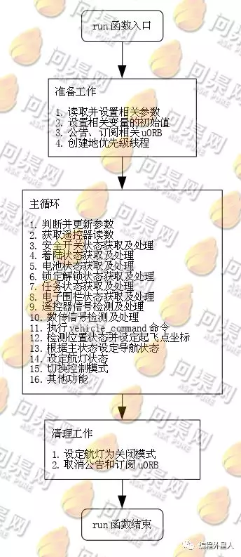
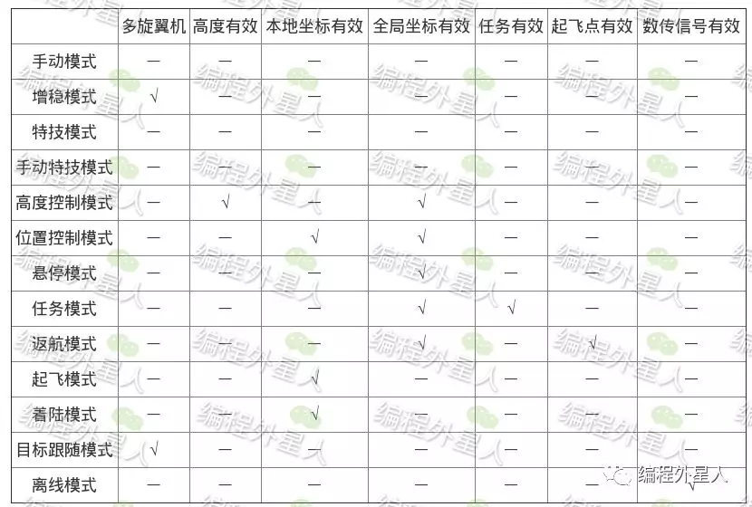

# PX4

## Build (make)

the make command under ./Firmware folder

make \[VENDOR_]\[MODEL]\[\_VARIANT] [VIEWER_MODEL_DEBUGGER] (注意下划线)

VENDOR ： manufacturer of the board

MODEL : board model : "fmu-v2","fmu-v3",...

VARIANT: indicate particular configurations , most commonly "default"

use command : make list_config_targets  to see all available targets

## 仿真

详见 PX4 手册 building code 章节 启动 jmavsim & gazebo

gazebo 与 jmavsim 可以与 QGC 使用，同时打开两者，QGsouC 可以自动检测到虚拟环境的飞机

### 先编译后仿真

```bash
# build and use launch file
DONT_RUN=1 make px4_sitl_default gazebo
source Tools/setup_gazebo.bash $(pwd) $(pwd)/build/px4_sitl_default

# add Firmware file as a ros package
export ROS_PACKAGE_PATH=$ROS_PACKAGE_PATH:$(pwd):$(pwd)/Tools/sitl_gazebo
```

在 Firmware/launch 下有 .launch 文件可以配置仿真参数


同样， GPU rplidar 需要更改成 CPU 版本：

```xml
<sensor name="laser" type="ray">
        <ray>
          <scan>
            <horizontal>
              <samples>360</samples>
              <resolution>1</resolution>
              <min_angle>-3.14</min_angle>
              <max_angle>3.14</max_angle>
            </horizontal>
          </scan>
          <range>
            <min>0.2</min>
            <max>6</max>
            <resolution>0.05</resolution>
          </range>
          <noise>
            <type>gaussian</type>
            <mean>0.0</mean>
            <stddev>0.01</stddev>
          </noise>
        </ray>
        <plugin name="laser" filename="libRayPlugin.so" />
        <plugin name="gazebo_ros_head_rplidar_controller" filename="libgazebo_ros_laser.so">
          <topicName>laser/scan</topicName>
          <frameName>rplidar_link</frameName>
        </plugin>
        <always_on>1</always_on>
        <update_rate>5.5</update_rate>
        <visualize>true</visualize>
      </sensor>
```

同时 rplidar 不能与 lidar 同时使用，有冲突

关于仿真模型，在 rcS 中会source 特定的仿真模型的启动脚本以设置参数。在加入自己的新模型时要加入自己的 bash 文件，写法可以随便抄一个。
## 书写规则
一般情况下 [....] 代表输入参数

## hardware
在 QGC 上插入 pixhawk4 飞控板后，会显示飞控版本,根据这个选择 make 时候的版本
### S-BUS
RC 与 接收机之间的通信协议，软件驱动在 /src/drivers/linux_sbus (架构同 GPS)
### PWM&PPM
在 /src/drivers/pwm_input 下；_timer_init 时初始化定时器，pwmin_tim_isr 是中断处理函数
PPM 是指在一个输入口同时接受多路PWM信号
### sensor
部分仪器校准文件在 Commander 下，
## 启动脚本分析
在 /src/driver/px4io/px4io.cpp  是主处理器对协处理器的操作
下面对应的 update 选项是 烧写对应的二进制文件到协处理器中.

在build/px4_fmu-v2_default/NuttX/apps/system/nsh/nsh_main.c
是对 nsh 初始化 --> nsh_console --> nsh_initscript 对 rcS 
## Mixer (混合控制)
经过位置控制和姿态控制后，控制量通过 actuator_controls发布，其中 control 数组存放了四个的控制量。(roll, yaw, pitch , throttle) 这四个量投影到不同的轴臂上，投影关系即是混控矩阵。
ROMFS/px4fmu_common/mixer 存放了不同机型的混控文件 *.mi
空混控器：接受输入，输出0
简单混控：将多通道的控制量进行混合
M：\<control mount>
S:  \<group> \<index> \<ve scale> \<offset> \<lower limit> \<upper limit>
R：\<geometry> \<roll scale> \<pitch scale> \<yaw scale> \<deadband> deadband 是设置最大值进行归一化。
##  构架
主处理器 F4 (姿态估计与控制) \ F1 IO 口
主处理器为协处理器下载固件 (Firmware/drivers/px4io)
PX4IO_Uploader (struct) (px4_io_start main function)
协处理器 (modules/px4iofirmware)
1. 数据存储： 飞行任务存储 ； 飞行参数存储 ； (param_get, param_set 读写参数) ；飞行日志，早期为存储到 sdcard .csv 文件，近期由 logger 保存 uORB 信息。
2. 外部通讯： 采用MAVLINK 协议
3. 驱动程序： 遥控器驱动，协议有 SBUS\PPM , SBUS 采用串口通讯 ；
4. 飞行控制： Sensor Hub : 收集传感器数据并送到 ekf2 模块； ekf2 对飞机姿态和位做出估计；位置控制 -> 姿态控制 -> 控制输出 (由姿态控制的控制量根据 Mixer 混控文件，输出 PWM 控制信号)


### 文件构架

(一律在 Firmware 目录下)

/boards/px4/fmu-v5/default.cmake 是总的 make 框架（configuration）

/Firmware 下 ：mavlink 与通讯协议有关， platforms 操作系统 ， ROMFS ROM文件系统

## concept

flight task (navigator & Position control set your way points) in Firmware/src/lib/FlightTasks as libraries

one flight task at one time

add tasks in FlightTasks/ folder (see template files under FlightTasks/templates/ )

mixing \ actuators : mixing takes force commands (eg. turn right) and translate them to actuator commands which control motors and servos

controller -> (force or torque demand) mixer -> (sets) individual actuators -> output driver

control groups ( physically : one for a bus)

## drivers(hardware)

在操作系统中硬件设备注册的节点以文件形式存在(/dev/xxx)， 以 Linux , Unix 为最。其为应用程序提供读写等方法(open, close, read, write, seek, ioctl)。(GPIO, UART, USB, SPI ... 都是这样)
解释 ioctl : 系统调用， 传入一个与设备有关的请求码
```c++
// 定义通用文件操作结构体，由驱动程序自己实现
struct file_operations{
	int (*open)(FAR struct file *filep);
	int (*close)(FAR struct file *filep);
	ssize_t (*read)(FAR struct file *filep, FAR char *buffer, size_t buflen);
	ssize_t (*write)(FAR struct file *filep, FAR const char *buffer, size_t buflen);
	off_t (*seek)(FAR struct file *filep, off_t offset, int whence);
	int (ioctl)(FAR struct file *filep, int cmd, unsigned long arg); // cmd 是指令，自定义
} // 此处均为函数指针
// 驱动程序向操作系统注册节点  (C 语言使用)
int register_driver(FAR const char *path, FAR const struct file_operations *fops, mode_t mode, FAr void* priv);
/* path : 文件路径
	fops : 文件操作结构体
	mode: 设备权限
	priv: 需要存放自定义的数据内容
*/

// C++ 定义一个继承 CDev 的类并重写文件操作方法
class PWMIN : cdev::CDev
{
public:
	PWMIN();
	virtual ~PWMIN();
	virtual int init();
	virtual int open(struct file *filp);
	virtual ssize_t read(struct file *filp, char *buffer, size_t buflen);
	virtual int ioctl(struct file *filp, int cmd, unsigned long arg);
	//  ....
private:
	uint32_t _error_count;
	// ...
};
int
PWMIN::init()
{
	/* we just register the device in /dev, and only actually
	 * activate the timer when requested to when the device is opened */
	CDev::init();  // 注册设备
	// ... 
	return OK;
}
// C 中实现
..... 声明函数
static struct fops =
{
	.open = led_open,
	.close = led_close,
	.read = led_read,
	.write = led_write,
    .seek = led_seek,
    .ioctl = led_ioctl    // 具体操作 
}
// 实现各函数，在 open 时要设置 gpio

//在入口函数里：
int main (int argc, char *argv[]){
    if (argc <= 1){
        return -1;
    }
    
    if (strcmp(argv[1],"start") == 0){
        if(register_driver("/dev/led", & fops, 0666, NULL) == 0){
            print("led reg err .\n");
            return -1;
        }
    }
    
    if( strcmp(argv[1], "stop") == 0){
        unregister_driver("/dev/led");
    }
    
    if(strcmp(argv[1], "on") == 0){
        int fd = open("/dev/led", O_RDWR);  // O_RDWR 可读写
        if(fd < 0 ){
            printf("couldn't open /dev/led. \n");
            return -1;
        }
        ioctl(fd, CMD_LED_ON, 0);
        close(fd);
        return 0;
    }
    
    // omitted ...
}
```

总结：启动/停止 对应注册，取消注册设备；
每一次使用时都是先打开文件，进行读写 或 ioctl 操作(调用相应函数)
driver 的 CMakeLists
```cmake
px4_add_module(
	MODULE drivers__led    # drivers__[name]
	MAIN led  # 入口函数 [name]__main
	STACK_MAIN 2000
	SRCS
		
	DEPENDS
		platforms__common
)
```

## drivers(software)

将源码与教程混合，以 GPS 为例

关于 ModuleBase, 在 px4_module.h有使用说明

```c++
// 源码中定义一个 driver 的基类，包括main 函数 (GPS 继承 ModuleBase<GPS>)
int  // 入口函数
gps_main(int argc, char *argv[])
{
	return GPS::main(argc, argv);
}
/* 在 main 中会调用一个 start_command_base 启用一个线程GPS 中的 task_spawn 有两种模式 MAIN, SECONDARY; 
	对于 MAIN ， 入口函数 run_trampoline 在基类中定义， 调用run 函数， 另一个在 gps.cpp 下重新定义了*/

// 教程， 创建后台进程
static int _running = 0; // 标志符

void start(){
    _running = 1;
    int task = px4_task_spawn_cmd("gps", SCHED_DEFAULT, SCHED_PRIORITY_SLOW_DRIVER, CONFIG_PTHREAD_STACK_DEFAULT, &gps_core, NULL);
}

void stop(){
    _running = 0;
}

int gps_core(int argc, char *argv[]){
    char buff[200];
    int fd = open("/dev/ttyS2", O_RDONLY | O_NONBLOCK);
    if (fd < 0){
        printf("open dev err. \n");
        return -1;
    }
    
    while(_running){
        int len = read(fd, buff, 200);
        if (len > 0){
            // operations here ...
        } 
        
        usleep(10000);
    }
}
```

## application

application 的 main 函数命名为 <module_name>_main 

```c++
__EXPORT int simple_main(int argc, char* argv);
```

functions :

PX4_INFO(...)  =  printf(...)

### multi-thread

创建进程的函数

```c++
#include <unistd.h>
#include <px4_config.h>
#include <px4_defines.h>
#include <px4_tasks.h>

px4_task_t px4_task_spawn_cmd(const char * name,
                             int scheduler,
                             int priority,
                             int stack_size,
                             px4_main_t entry,  // 传入入口函数
                             char *const argv[])
// 入口函数处 ： (px4_main_t) [process_name]
```

创建多线程

```c++

int pthread_create(FAR pthread_t *thread,  // 线程标识符
                   FAR const pthread_attr_t *att,  // 线程属性（栈内存，调度优先级）
                   pthread_startroutine_t start_routine,  // 函数入口
                   pthread_addr_t arg)
// 返回 0 成功， 正数失败
 
    // 初始化线程属性
    int pthread_attr_init(FAR pthread_attr_t *attr)
    // 销毁进程属性
    int pthread_attr_destroy(FAR pthread_attr_t *attr)
    // 设置线程栈内存大小
    int pthread_attr_setstacksize(FAR pthread_attr_t * attr, long stacksize)
    //取得线程调度参数
    int pthread_attr_getschedparam(FAR const pthread_attr_t * attr, FAR struct sched_param *param)
    //设置线程调度参数
    int pthread_attr_setschedparam(FAr pthread_attr_t *attr, FAR const struct sched_param *param)
    
//多参数传入
typedef struct TaskArg_{
	int x;
	int y; // 等等
}  TaskArg
typedef TaskArg* task_arg;
//线程初始化
pthread_attr_t pth_attr;
pthread_attr_init(&pth_attr);
pthread_attr_setstacksize(&pth_attr, 1000); // 设置堆栈大小为 1000
//设置线程优先级 
struct sched_param pth_param;
pthread_attr_getschedparam(&pth_attr, &pth_param);
pth_param.sched_priority = 100;
pthread_attr_setschedparam(&pth_attr, &pth_param);
//创建线程
pthread_t pth;
// 初始化参数
TaskArg arg;
arg.x = 1;
arg.y = 2;

pthread_create(&pth, &pth_attr, pth_run, (void *) &arg);   // pth_run 为入口函数

void* pth_run(void* arg){
	char pth_name[20];
	strcpy(pth_name, "20");
	prctl(PR_SET_NAME, pth_name, getpid());     // 为线程设置名称(由第一个参数确定--> PR_SET_NAME)
	// 调用参数
	task_arg arg_in = (task_arg)arg;
	arg_in->x = ... 
}
```

### work_queue
相当于一个堆栈，在一定时间和执行相应函数。
```c++
int work_queue(int qid, // HPWORK/ LPWORK (高/低)优先级
								FAR struct work_s *work, // 工作队列结构体
								worker_t worker,  // 入口函数
								FAR void* arg,    
								systime_t delay)  // 延迟执行时间
work_queue(HPWORK, &_work,(worker_t) &func, (void *)arg, 100);
```
在函数内使用可以起到循环反复执行的效果

### commander

commander 命令的主函数在 /src/modules/Commander.cpp 下， commander_main()

start 命令：经过一串执行后，最后是执行Commander::run 函数，而 run 里面又开了一个commander_low_prio_loop 函数的线程，里面有对命令的应答，此线程随 commander::stop 结束

calibrate: commander calibrate [accl|gyro|mag|level|airspeed] 校准仪表：具体校准看相应函数：arming_state_transition 是解锁前检查

check : 起飞前检查

arm/disarm : 飞控解锁(锁定) （ROS 里面获得飞机操控权也需要这个）解锁需要通过航前检查

takeoff/land 

mode : 飞机的飞行模式



arming_state ：飞机的锁定与解锁状态，在 vehicle_status.msg 中 只有arming_state 为 ARMING_STATE_ARMED 时，才表示飞机解锁。用于实际对电机控制是 actuator_armed.msg 的 bool armed; arming_state 之间的转换在arming_transitions 数组里表示。

main_state : 主状态   不同模式需要的状态

主状态在 commander_state.msg 中，由 main_state_transition 处理

nav_state : 导航状态 vehicle_state.msg 中 nav_state 决定。无人机会根据当前状态与不同条件对导航状态进行降级评估。在实际飞行时遇到异常会修改导航状态。

### navigation

自动航线： /src/modules/navigator.  NavigatorMode 作为基类，MissionBlock 继承 NavigationMode, 其余各模式继承 MissionBlock。其中一些对应 nav_state 中的状态。(eg. DataLinkLoss, EngineFailure, FollowTarget ....)采用基类指针的多态方式。

整个导航模块在 Navigator::run() 中运行。在run() 调用其余虚函数。

在MissionBlock::mission_item_to_position_setpoin() 中设置目标点， is_mission_item_reached() 判断是否到达目标。

### PID_control

四旋翼的姿态与位置控制在 /src/modules/mc_att_control (mc = multicopter)

角度控制采用串级反馈控制，一级期望角度为输入，二级以期望角速度为输入。二级控制系统对于系统的状态检测更加敏感。

原文件下 control_attitude()  / control_attitude_rate() 控制源码。

位置控制源码在 /src/modules/mc_pos_control 下

### bootloader

初始化硬件设备，建立内存空间映射图 (类似 BIOS)  Cortex-M3, 依据其内核启动方式

PX4_FMU nash_main()  执行飞控的固件启动脚本  (Romfs/Px4fmu_common/Init.d/rcS)

PX4_IO      

硬件 -- > 传感器 

### topic

using uORB 

与 ros 的消息机制很像，数据格式的头文件在 build 后生成

消息调用中用到了 poll() 函数， 作为处理数据收发的中断函数

### CMakeLists.txt

添加模块 ：

px4_add_module ,  详见 Firmware/cmake/px4_add_module.cmake 

```cmake
px4_add_module(
    MAIN [string : entry point]
    SRCS
        [string : source file]
    DEPENDS
)

入口函数就是 [string]_main
```

and add these examples under ./board/../default.cmake

## ROS

在 mavros 下 offb_node.cpp 中展示如何控制飞机(waypoints) 

在切换到 offboard 模式前，setpoints 里面需要有信息。控制流程为

--> OFFBOARD --> ARM --> publish waypoints 

## Mavlink

/firmware/mavlink 各类协议的定义和公共调应用函数；以 mavlink_msg_ 开头的头文均是Mavlink的消息。

数据总线源码在 /src/modules/mavlink
1.MavlinkStream 时所有发消息的基类，其余实际消息继承此类
2.MavlinkReceiver 负责消息的接受，解析和处理。在接受到消息后，交给各不同业务的处理程序同时分析这个消息包。
3.MavlinkMissionManager: 传输任务相关数据。
4.MavlinkFTP: 文件传输服务

## uORB

uORB 实际是多个进程打开同一个设备文件，进程间通过此文件节点进行数据交互和共享。

同 ROS 相同，定义 msg 之后自动生成头文件并定义结构体， 在 /Firmware/msg 下。在 /template 可以找到替换的模板。

```c++
struct msg_struct msg;
memset(&msg, 0, sizeof(msg));
orb_advert_t pub = orb_advertise(ORB_ID(), &msg);

// set your message
orb_publish(ORB_ID(), pub, &msg);
```

poll() 函数： waits for one of a set of files descriptors to become ready to perform(I/O), 用来等待消息发布。
```c++
#include <poll.h>
int poll(struct pollfd *fds, nfds_t nfds, int timeout);
// nfds should specify the number of items in fds
struct pollfd {
  int fd; //file descriptor (in PX4, it's the handle)
  short events; // requested events
  short revents; // returned events
}
```
events is an input parameter, specifying the event that application is interested in  for file descriptor.

events 和 revents 可以有以下参数

1. POLLIN There is data to read

2. POLLOUT Writing is possible

orb_check() 可以替代 poll() 函数
```c++
int orb_check(int handle, bool *updated);

bool updated;
struct random_integer_data rd;

/* check to see whether the topic has updated since the last time we read it */
orb_check(topic_handle, &updated);

if (updated) {
    /* make a local copy of the updated data structure */
    orb_copy(ORB_ID(random_integer), topic_handle, &rd);
    printf("Random integer is now %d\n", rd.r);
}
```

# 多线程

线程是操作系统执行计算机程序的最基本单元。启动一个可执行程序即是一个进程。一个进程在 linux 下分为  代码段/堆栈段/数据段。不同的进程代码段相同，数据段不相同。每次调度时，分配内存资源和继承控制块 PCB，并设定寄存器和数据段内存地址和代码段内存地址，分配任务 ID (task ID)。

进程可以调用线程，多线程会共享内存单元

对于嵌入式系统而言，引入工作队列节省内存消耗，最为操作系统的一个调度单元

堆栈段存放 子程序返回地址，子程序参数，程序的局部变量

数据段存放全局变量，常数，动态分配空间

## 控制

fork() 创建进程，子进程复制父进程的堆栈段和数据，两者之间数据分开，通过进程间通讯交换数据。对于父进程，fork() 返回子程序的进程号，而对于子进程，返回0。两者都要执行 fork() 下的代码。

```c++
void main(){   
int i;   
if ( fork() == 0 ) {   
/* 子进程程序 */   
	for ( i = 1; i <1000; i ++ ) printf("This is child process/n");   
}   
else {   
/* 父进程程序*/   
	for ( i = 1; i <1000; i ++ ) printf("This is process process/n");   
	}   
}   
```

exec()函数族 进程调用另外一个程序，此时子进程死亡，而且各个段均被清除。

```c++
char command[256];   
void main()   
{   
int rtn; /*子进程的返回数值*/   
while(1) {   
/* 从终端读取要执行的命令 */   
printf( ">" );   
fgets( command, 256, stdin );   
command[strlen(command)-1] = 0;   
if ( fork() == 0 ) {   
/* 子进程执行此命令 */   
 // 此处采用 execlp 是函数族中一个
execlp( command, command );   
/* 如果exec函数返回，表明没有正常执行命令，打印错误信息*/   
perror( command );   
exit( errorno );   
}   
else {   
/* 父进程， 等待子进程结束，并打印子进程的返回值 */   
wait ( &rtn );   
printf( " child process return %d/n",. rtn );   
}   
}   
}  
```

管道

无名管道：父进程和子进程通信

无名管道 由 pipe() 创建

```c++
#define INPUT 0   
#define OUTPUT 1   
  
void main() {   
int file_descriptors[2];   
/*定义子进程号 */   
pid_t pid;   
char buf[256];   
int returned_count;   
/*创建无名管道*/   
pipe(file_descriptors);   
/*创建子进程*/   
if((pid = fork()) == -1) {   
printf("Error in fork/n");   
exit(1);   
}   
/*执行子进程*/   
if(pid == 0) {   
printf("in the spawned (child) process.../n");   
/*子进程向父进程写数据，关闭管道的读端*/   
close(file_descriptors[INPUT]);   
write(file_descriptors[OUTPUT], "test data", strlen("test data"));   
exit(0);   
} else {   
/*执行父进程*/   
printf("in the spawning (parent) process.../n");   
/*父进程从管道读取子进程写的数据，关闭管道的写端*/   
close(file_descriptors[OUTPUT]);   
returned_count = read(file_descriptors[INPUT], buf, sizeof(buf));   
printf("%d bytes of data received from spawned process: %s/n",   
returned_count, buf);   
}   
}   
```

