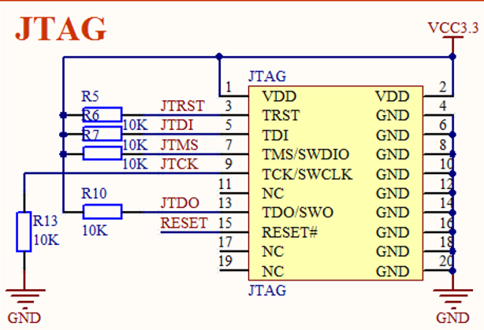

# hardware setup

VDD digital power supply (positive digital input)

VSS GROUND (pin ground) 两者之间加入电容 一个是滤波(电源不稳定)

ST-LINK v2 

SWCLK (clock) ; SWDIO (data input & output) ; power supply (for the micro chip)  you can find the corresponding pins on stm32 chip (SWCLK SWDIO) 

SWCLK pull low externally (link to GND); SWDIO pull high 

for JTAG , pins are same (正点原子 STM32F1 的板子)



you can also find SWDIO is pulled up while SWCLK is pulled down.

## Degub protoptype (JTAG / SWD)

<https://blog.csdn.net/LEON1741/article/details/72846434>

JTAG 是芯片内部的测试协议。标准的JTAG接口是4线：TMS、 TCK、TDI、TDO，分别为模式选择、时钟、数据输入和数据输出线。 相关JTAG引脚的定义为：

TMS：测试模式选择，TMS用来设置JTAG接口处于某种特定的测试模式；

TCK：测试时钟输入；

TDI：测试数据输入，数据通过TDI引脚输入JTAG接口；

TDO：测试数据输出，数据通过TDO引 脚从JTAG接口输出；

SWD，串行调试(Serial Wire Debug), 更少的引脚(4 个), 大数据下更稳定。


可以看到对上面正点原子的板子， SWD 与 JTAG 共用了一个口

### 仿真器

jlink 

基于 JTAG 仿真，面对计算机采用 USB 口， 对板仍然采用 JTAG 口

ST - link

专门针对 ST 公司的芯片， 可以烧写，仿真，下载

## communication

### UART

异步收发串行通信  <--> 同步方式 (USART)

规范标准 ： RS232. RS449

COM 是 PC 上异步串行通信口 RS232


开始时保持低电平是为了保证数据线正常。以低电平表示开始传输数据。UART 在接受完成后，将设置标记表示数据可用( 中断处理函数中常作检验 )，并产生一个处理器中断。

## chip Reg

### CLOCK

RCC (Reset Clock Control) 

AHB (Advanced High performance Bus)

### GPIO

MODER (mode register)

OTYPER (output type register)


# IDE 

## Coox 

the repo(libs) follows a git format, and you may search the whole folder to find the file (if missing !)

# Program 

stmf4xx.h has defines about registers

```C++
RCC -> AHBENR |= RCC_AHBENR_GPIOCEN ; // or (1 << 19) specify the bits

// set zero

GPIOC -> OTYPER &= ~(...) 
```
